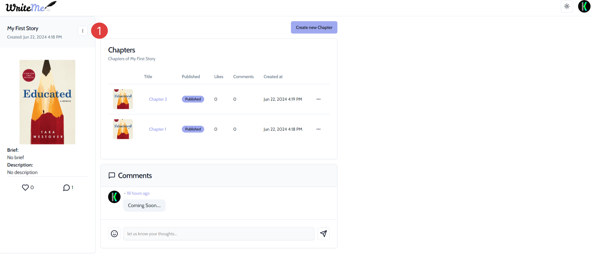
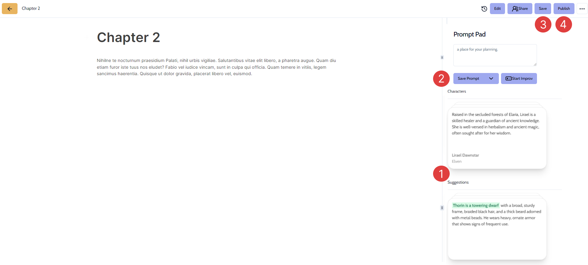
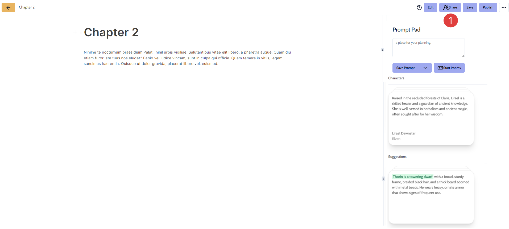
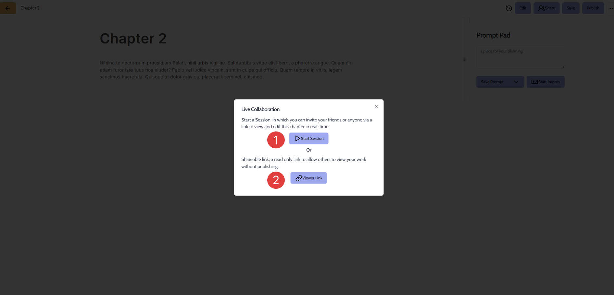
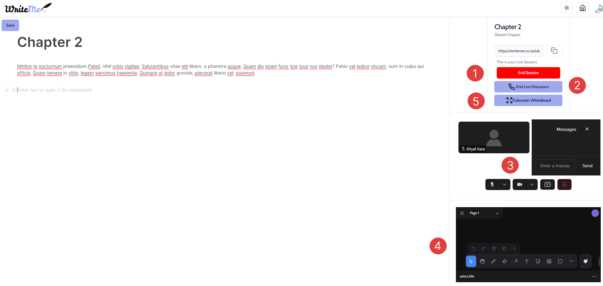
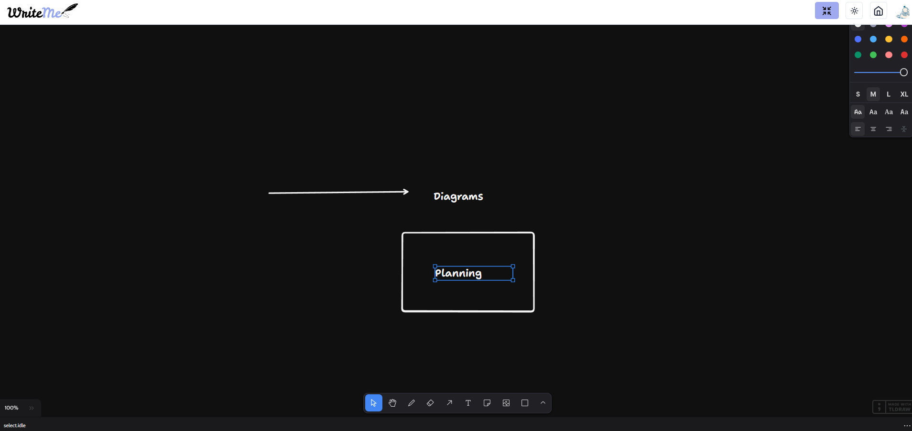
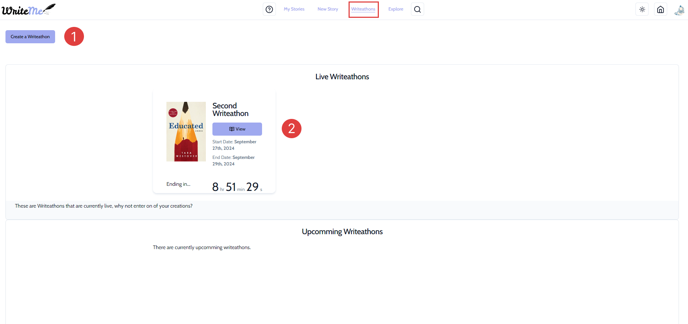
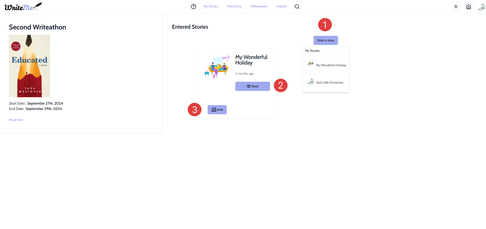

# User Manual 

## Table of Contents

- **[Introduction](#introduction)**
- **[App Usage](#app-usage)**
    - **[Landing Page](#landing-page)**
    - **[Sign Up Page](#sign-up)**
    - **[Login Page](#log-in)**
    - **[My Stories Page](#my-stories)**
        - **[Edit existing story metadata](#edit-existing-story-metadata)**
        - **[Edit existing chapter metadata](#edit-existing-chapter-metadata)**
        - **[Create a New Chapter](#create-a-new-chapter)**
        - **[Live Collaboration](#live-collaboration)**
        - **[Live Collaboration Session](#live-collaboration-session)**
    - **[A New Story](#a-new-story)**
    - **[Explore Page](#explore-page)**
    - **[Profile Page](#profile-page)**

## Introduction

Welcome to WriteMe, new platform that changes how people create, share, and enjoy stories. Imagine WriteMe as your personal space where you can write amazing stories and discover captivating tales from others. It's designed to be super easy to use, with tools that help you write better and share your stories effortlessly. 

In today's world, we love reading and sharing stories online. WriteMe makes it simple: you can sign up easily, write your stories in a secure place, and publish them with just a few clicks. You can also explore stories from different writers and connect with a community of readers and writers who share your passion. 

WriteMe is there for you, ensuring your experience is smooth and enjoyable. Join us in bringing stories to life in a whole new way!

## App Usage

1. Navigate to **[WriteMe](https://writeme.co.za/)**

### Landing Page

This page serves as the initial interface, where you will be presented with options to either log in or sign up. You can click on the **"Join Now"** button which will take you to the sign up page and if you already has an account you will have an option to log in by clicking on the **"Login"** button.  

If you wish to just explore you may click on the **"Explore"** option, which will allow you to have a preview of the website without having to make an account, however, you will have limited functionality. 

### Sign Up 

If you would like a quick and easy way to signup, you may simply click on the **"GitHub"** or **"Google"** buttons.

1. Enter your full name.
2. Enter your email address.
3. Enter a password and confirm that it is correct by entering it again.
4. Click **"Sign Up"** once you have confirmed that you entered the correct details. 

### Log In 

If you would like a quick and easy way to login, you may simply click on the **"Login with GitHub"** or **"Login with Google"** buttons.

1. Enter the email address you created during registration. 
2. Enter the password you created during registration
3. Click **"Login"**, if the details are correct, you correct, you will be directed to the **Explore** page 

### My Stories 

Once you have been logged in, you will be taken to the **"My Stories"** page. This page will display all the stories that you have saved and published.

1. Click on the **"View"** button on a story you would like to view/edit

#### Edit existing story metadata

1. Click on the three dots to select the **"Edit"** option. You will then be taken to the page where you may edit your story metadata.

1. This button will allow you to update the image that you will be using for your story. 
2. You can update the title of your story. 
3. This will allow you to change whether your story is visible to the public or not.
4. You can update the brief of your story. 
5. You can update the description of your story. 
6. This will allow you display the genre of your story. 

#### Edit existing chapter metadata

1. Click on the three dots to select the **"Edit"** option. You will then be taken to the page where you may edit the chapter metadata.

1. This button will allow you to update the image that you will be using for your chapter. 
2. You can update the title of your chapter. 
3. You can update the brief of your chapter. 
4. You can update the description of your chapter. 
5. This will allow you to choose whether your chapter is visible to the public or not. 

#### Edit existing chapter

1. Click on the title of the chapter you would like to edit and this will take you to the editor. 

1. This panel will show you a variety of ideas for various characters and also suggestion to aid you when you are writing a story.
2. This is where you can use the **Prompt Pad**, this is used when you have a writers block and would like to get interesting questions to stir your creative juices. You can either click on **Start Improv**, to get random questions, or click on **Save Prompt** to save your answers to refer back to.
3. You can click on the **"Save"** button which will save your story and only you will be able to view it.
4. Once you are confident, you can click on the **"Publish"** button to publish your story for others to view.

#### Live Collaboration

1. You can click on **Share** button to start a live collaboration which will open a popup.

1. You may either click on **Start Session** to start a live collaboration where users with the link can access the story and also contribute and communicate via live voice chat and messaging. 
2. Or you may click on **Viewer link** which can be shared with other users that can view live updates to your story while you work on it.

#### Live Collaboration Session

1. This button will allow you end the live collaborations session.
2. This button will end the live voice chat if you wish to work in peace.
3. These are all the available options for voice chat and if needed you may also send messages to other users via the chat box.
4. You may also use this whiteboard to write, draw  and brainstorm ideas related to your story.
5. If you would like more space regarding the whiteboard, you may click on **FullScreen WhiteBoard** button as shown below.

#### Create a new chapter

1. Click on the **"Create new Chapter"** button. You will then be taken to a new page.

1. Enter a compulsory **"Title"** that fits the chapter you would like to write.
2. Enter an optional **"Brief"**.
3. Enter an optional **"Description"**.
4. Once you are satisfied with everything, you can click on the **"Submit"** button. 

### Writathons

You can navigate to this page by clicking on the **"Writathons"** tab in the navigation bar on the top.

1. Click on the **Create a Writathon** button which will allow to start your very own writathon.
2. To view ongoing writathons you may choose one that catches your eye and click on the **View** button.

1. Click on the **Enter a story** button to submit your very own story in the writathon.
2. You may click on the **Read** button on any of the currently submitted stories that other users have submitted.
3. This button allows you to vote on individual stories that have been submitted as shown below.

1. Click on the **Submite Vote** button once you have made your decision!

### A New Story

You can navigate to this page by clicking on the **"New Story"** tab in the navigation bar on the top.

1. Enter a compulsory **"Title"** that fits the story you would like to write.
2. Enter an optional **"Brief"**.
3. Enter an optional **"Description"**.
4. Once you are satisfied with everything, you can click on the **"Create Story"** button. 
5. You may also click on this button to start our on-boarding process that will take you through a step-by-step guide on getting started with writing a new story!

### Explore Page

You can navigate to this page by clicking on the **"Explore"** tab in the navigation bar on the top. This page showcases everyone's published stories. 

1. Click **"Read"** on any story you would like to view. This will take you to the page that will display the story. 

You may interact with the story in various ways. Such as: 

1. You may **Like** the story by clicking on the heart button to show your interest.
2. You may **Share** the story by clicking on the share button to share it on various platforms. 

3. You may **Download** the story by clicking on the download button for offline reading. 
4. The comment sectin allows you to view everyone's opinions and also add your very own opinion on the story. 
5. This is where you may select a particular chapter you would like to read. This will take you to a different page to read the chapter. 

1. This allows you to **Share** an individual chapter to others. 
2. This allows you to **Like** an individual chapter. 
3. This allows you to **Comment** on an individual chapter.

### Profile Page

You can navigate to this page by clicking on your profile on the top right corner and clickingon **"My Profile"**.

1. Click on the **Edit Profile"** button to update your bio and other necessary information. 

1. Update your **Name**.
2. Update your **Email**.
3. Add/update your **Bio**.
4. Once you are done you may click on the **Update profile** button.
5. If you wish to no longer have the account, you can click on the **Delete account** button.

