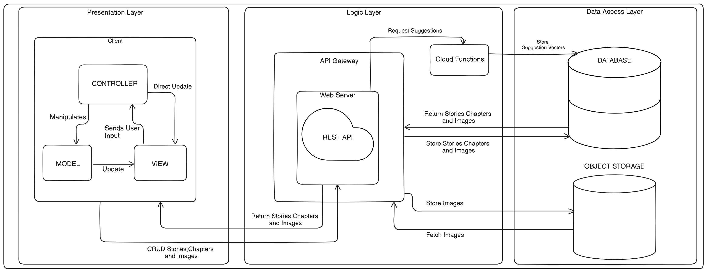

import TOCInline from '@theme/TOCInline';

# Architectural Requirements

<TOCInline toc={toc} />

## Introduction

This document serves as a blueprint of our team's approach in defining the architectural framework for WriteMe, an innovative collaborative writing platform. It outlines our stategic methodology, the architectural patterns employed, the quality requirements influencing our decisions, the constriants encountered, and the chosen technologies that power our system.

## Architectural Design Strategy

Our architectural design strategy focuses on creating a collaborative writing platform that is robust and user-friendly. We start by breaking down our system into clear functional and quality requirements, using practical use cases to guide our development process. This helps us build modular subsystems and components that are flexible and easy to maintain. By carefully selecting architectural patterns that enhance storytelling and user engagement, we ensure our platform integrates seamlessly with Natural Language Processing (NLP) tools. This approach guarantees that WriteMe provides a cohesive and enjoyable writing experience, inspiring creativity and enabling writers to thrive.

## Architectural Styles

1. Multi-tier Architechture
2. Model View Controller Architecture
3. Client-Server Architecture
4. REST Architecture

### 3.1 Multi-tier Architecture

Our software architecture doesn't adhere to a strict layered model due to the bidirectional communication pathways between its components. Instead, it's organized into distinct tiers, each housing a specific set of functionalities.

The web application's user interface (UI), API calls, cloud functions for data processing, and database interactions are all physically separated, residing on their own independent tiers. Each tier acts as a cluster of modules, collectively providing a cohesive set of services.

In our mapping system, we've defined three primary tiers:

- Presentation Tier: This encompasses the user interface and application client interfaces, responsible for visual rendering and user interaction.

- Logic Tier: This serves as the central hub, managing interactions between various components such as the key-value storage, client, cloud functions, API gateway. It handles the core application logic and data manipulation.

- Data Access Tier: This tier is dedicated to data storage and retrieval, encompassing the database and media storage.

This tiered structure, while allowing bidirectional communication, maintains a clear separation of concerns, promoting modularity, flexibility, and easier maintenance of the system

### 3.2 Model View Controller Architecture

Our web application's client-side interaction is structured around the Model-View-Controller (MVC) architectural pattern, albeit with a modern twist. We leverage Next.js as our front-end framework, which implements a refined version of MVC known as Model-View-ViewModel (MVVM).

Next.js's MVVM architecture facilitates seamless two-way data binding between the View and the ViewModel. This dynamic relationship enables our web application to automatically propagate changes within the user interface. Whenever a change event occurs, the UI is updated to reflect the modified state within the front-end data bindings. This capability is particularly advantageous for our colabertative system, where real-time updates are essential. While MVVM permeates our entire application, its primary role lies within the presentation layer. Here, it ensures that the UI remains responsive and accurately mirrors the underlying state changes, enhancing the user experience.

In our Next.js implementation:

- View: Server Component files define the visual layout and appearance of the user interface.

- Model: Files in the db and services folder which encapsulate the logic and data management. This defines a contract for interacting with back-end services.

- Controller (ViewModel): Client Component files act as the bridge between the View and Model. They handle user input, manage data binding, and orchestrate UI updates based on changes in the Model.

### 3.3 Client-Server Architecture

In our system, the display of information to the client is facilitated through a dedicated interface, API, that communicates with the database.

This database houses all the important information and data about the users, stories, chapters as well as interactions from the users.

User interaction with the UI components triggers calls to the server. For instance, opening a book triggers the backend to retrieve said book and display it accordingly.

### 3.4 REST Architecture

Our system utilizes a REST API for synchronous communication. This API responds to requests made to resource URIs with JSON-formatted payloads, specifically handling PUT, GET, and POST methods.

Within our system, the REST API governs operations on the media storage, managing the creation, retrieval, modification, and deletion of users, stories, chapters and interactions between them.

The REST architectural style contributes significantly to the scalability of our system and enables the establishment of a tiered architecture. Additionally, it enhances security by requiring a `Bearer: <Token>` header for accessing sensitive data, effectively preventing unauthorized access.

Furthermore, the REST API plays a crucial role in implementing the user registration mechanism. It facilitates communication with cloud functions, streamlining the registration process and ensures data integrity.

## 4 Architectural Quality Requirements

<ol className="srs-bullets">
  <li><strong>Performance</strong>
    <strong>Justification: </strong>Ensuring high performance is critical for user satisfaction and engagement. Fast response times and efficient handling of requests maintain the application's usability and prevent frustration. This is particularly important for file uploads and database interactions, as delays in these areas can significantly impact the user experience.
    <ol className="srs-bullets">
        <li>
        The application should remain responsive when calling the API.
          <strong>Implementation: </strong>
        Requests should be made asynchronously such that the webpage does not hang, and Next.js should be used for streaming the Response back to the client.
        </li>
        <li>
        File uploads should be completed in a reasonable amount of time, not exceeding 60 seconds, assuming a stable internet connection.
          <strong>Implementation: </strong>
        AWS buckets are used to achieve this, files are streamed from the API directly to the bucket, resulting in fast upload times.
        </li>
        <li>
        Hundreds of users may user the system daily resulting in a large amount of read write calls to the database. The system should be able to handle all of these requests with minimal response times.
          <strong>Implementation: </strong>
        </li>
    </ol>
  </li>
    
  <li><strong>Usability</strong>
    <ol className='srs-bullets'>
      <li>Intuitive Interface
        <ol className='srs-bullets'>
          <li>Include a well-organized menu and clear navigation paths to help users find features and tools quickly.
            <strong>Implementation: </strong>
          Component libraries such as shadcn will be used together with consistent CSS styling to incorporate a smooth and responsive user interface. 
          </li>
          <li>Provide tooltips, guides, and tutorials to assist users in understanding how to use various features effectively. 
            <strong>Implementation: </strong>New users will be introduced to the app via an onboarding process which will be implemented using shadcn and Framer Motion. The user will be able to turn the guide on / off at anytime they feel confused.
          </li>
          <li>Provide clear visual cues, such as buttons, icons, and labels, to guide users through the interface and indicate interactive elements.
            <strong>Implementation: </strong>Lucide icons will be used to display high quality icons.
          </li>
          <li>Feedback will always be given to the user when an action has been completed or if an error has occured.</li>  <strong>Implementation: </strong>Various toasts with messages will be used to provide feedback to the user. If an error has occured, detailed error messages will be displayed showing the user what may have occured. These functions should be implemented asynchronously such that the view does not hang or freeze.
        </ol>
      </li>
      <li>Collaboration Features
        <ol className='srs-bullets'>
          <li>Provide commenting / annotation tools that allow users to give feedback directly on the document.
            <strong>Implementation: </strong>
          A comment section will be implemented with polling, such that new comments will appear on viewers pages. 
          </li>
        </ol>
      </li>
    </ol>
  </li>
   
  <li><strong>Compatibility</strong>
     <ol className='srs-bullets'>
      <li>The app should be able to work consistently across various operating systems and devices.
        <strong>Implementation: </strong>
      The application is distributed as a PWA, making it available to any operating system or device that is able to run a modern web browser.
      </li>
      <li>The app should be able to run on mobile devices, with modern browsers.
        <strong>Implementation: </strong>
      The application is implemented using well supported css and javascript features, such that it is compatible with all major web browsers and screen sizes.
      </li>
    </ol>    
  </li>
   
  <li><strong>Security</strong>
    <ol className="srs-bullets">
        <li>
        The system will authenticate users using a hashed password protected login.
          <strong>Implementation: </strong>
        Bcrypt using the blowfish algorithm will be used to store the password hash of each user, only the hashed password  will be saved to the database.
        </li>
        <li>
        The system will prevent unauthorised users from accessing the pages using a JWT.
          <strong>Implementation: </strong>
        The JWT's are signed with a private key on the server and are valid for 24 hours. The JWT should be sent with each request, in the form of a bearer token, to the API if a user is logged in. Only logged in users will have acces to the full functionality of the application.
        </li>
    </ol>

  </li>
   
  <li><strong>Reliability</strong>
    <ol className="srs-bullets">
        <li>The system should be available and functional at all times once deployed, meaning an uptime greater than 99% should be achieved.  <strong>Implementation: </strong>Since the system is hosted on AWS uptime can be assumed due to their management.
        </li>
        <li>The application should make use of orchestration and continuous integration and deployment (CI/CD) such that no downtime is incurred, when deploying new features or fixes.
          <strong>Implementation: </strong>
        GitHub Actions are used along with <a href="https://sst.dev/" target="_blank">sst</a> for AWS to migrate changes and redeploy without down time.
        </li>
        <li>
        Runtime errors should be caught earlier to avoid down time of service.
          <strong>Implementation: </strong>
        Error logging should take place, high amounts of errors should notify the developers, using AWS CloudWatch.
        </li>
    </ol>
  </li>
</ol>

## 5 Architectural Constraints

### Security
Specific encryption standards are necessary to protect sensitive data from breaches and ensure that the app meets industry standards for data security.Thus, the use of standardized authentication protocols (e.g., OAuth) ensures secure user authentication and authorization, preventing unauthorized access and ensuring compliance with security best practices.

### Cost
The system requires the use of AWS, therefore implementing budget constraints within AWS will ensure that the overall cost of infrastructure and services does not exceed the allocated budget.

### Reliability

## 6 Architectural Diagram

## Technology Choices

### Framework

Next is a web application framework that is used to create full-stack applications.

- **Next.js:** 
  - **Advantage:** Offers server-side rendering and static site generation, improving performance and SEO for the application.

#### Alternatives

- Angular + SSR:

- Astro

### AWS S3 Buckets

#### Alternatives

- Google Cloud Platform

### AWS Amplify

### AWS Lambda

### REST

#### Alternatives

- GraphQL

### PostgresSQL

### Mono Repository Management

- **nx:**

  - **Advantage:** Provides efficient code sharing and dependency management across multiple projects, ensuring streamlined development and maintenance.

#### Alternatives

- turbo: 

### Package Manager

- **pnpm:** [pnpm](https://pnpm.io/)
  - **Advantage:** Ensures faster and more efficient package installation and management, reducing disk space usage.

#### Alternatives
