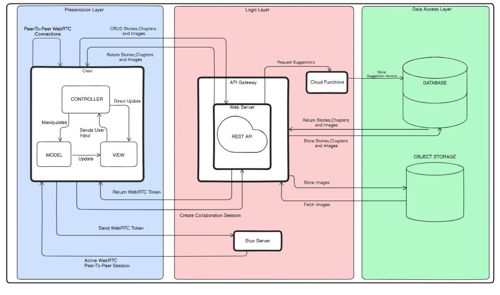
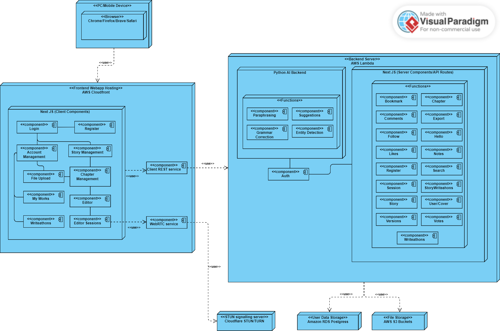

import TOCInline from '@theme/TOCInline';

# Architectural Requirements

<TOCInline toc={toc} />

## 1 Introduction

This document serves as a blueprint of our team's approach in defining the architectural framework for WriteMe, an innovative collaborative writing platform. It outlines our stategic methodology, the architectural patterns employed, the quality requirements influencing our decisions, the constriants encountered, and the chosen technologies that power our system.

## 2 Architectural Design Strategy

Our architectural design strategy focuses on creating a collaborative writing platform that is robust and user-friendly. We start by breaking down our system into clear functional and quality requirements made by the team and prioritised by the clients, using practical use cases to guide our development process. This helps us build modular subsystems and components that are flexible and easy to maintain. By carefully selecting architectural patterns that enhance storytelling and user engagement, we ensure our platform integrates seamlessly with Natural Language Processing (NLP) tools. This approach guarantees that WriteMe provides a cohesive and enjoyable writing experience, inspiring creativity and enabling writers to thrive.

Apart from reliability, performance, usability,compatibility and security the architecture should also be based around:

1. User-Centric Design:
Designing based on quality requirements puts the users' needs and expectations at the forefront. Since WriteMe is used by Readers and Writers and aims to build communities, the needs of our users' are paramount.
2. Facilitates Long-term Maintenance and Rapid Development:
A system designed based on quality requirements is generally more maintainable in the long run. When a system is created with a focus on aspects such as modularity, performance, reliability, and security, it is typically easier to identify and fix issues, add new features, and scale as needed all in a timely manner.

This is our main architectural strategy, other strategies like decomposition and generating test cases are still important and will be applied in the different phases of the project.

## 3 Architectural Styles

1. Multi-tier Architechture
2. Model View Controller Architecture
3. Client-Server Architecture
4. REST Architecture
5. Peer-to-peer

### 3.1 Multi-tier Architecture

Our software architecture doesn't adhere to a strict layered model due to the bidirectional communication pathways between its components. Instead, it's organized into distinct tiers, each housing a specific set of functionalities.

The web application's user interface (UI), API calls, cloud functions for data processing, and database interactions are all physically separated, residing on their own independent tiers. Each tier acts as a cluster of modules, collectively providing a cohesive set of services.

In our mapping system, we've defined three primary tiers:

- Presentation Tier: This encompasses the user interface and application client interfaces, responsible for visual rendering and user interaction.

- Logic Tier: This serves as the central hub, managing interactions between various components such as the persistent database storage, client, cloud functions, API gateway. It handles the core application logic and data manipulation.

- Data Access Tier: This tier is dedicated to data storage and retrieval, encompassing the database and media storage.

This tiered structure, while allowing bidirectional communication, maintains a clear separation of concerns, promoting modularity, flexibility, and easier maintenance of the system

### 3.2 Model View Controller Architecture

Our web application's client-side interaction is structured around the Model-View-Controller (MVC) architectural pattern, albeit with a modern twist. We leverage Next.js as our front-end framework, which implements a refined version of MVC known as Model-View-ViewModel (MVVM).

Next.js's MVVM architecture facilitates seamless two-way data binding between the View and the ViewModel. This dynamic relationship enables our web application to automatically propagate changes within the user interface. Whenever a change event occurs, the UI is updated to reflect the modified state within the front-end data bindings. This capability is particularly advantageous for our colabertative system, where real-time updates are essential. While MVVM permeates our entire application, its primary role lies within the presentation layer. Here, it ensures that the UI remains responsive and accurately mirrors the underlying state changes, enhancing the user experience.

In our Next.js implementation:

- View: Server Component files define the visual layout and appearance of the user interface.

- Model: Files in the db and services folder which encapsulate the logic and data management. This defines a contract for interacting with back-end services.

- Controller (ViewModel): Client Component files act as the bridge between the View and Model. They handle user input, manage data binding, and orchestrate UI updates based on changes in the Model.

### 3.3 Client-Server Architecture

In our system, the display of information to the client is facilitated through a dedicated interface, API, that communicates with the database.

This database houses all the important information and data about the users, stories, chapters as well as interactions from the users.

User interaction with the UI components triggers calls to the server. For instance, opening a story triggers the backend to retrieve said story and display it accordingly.

### 3.4 REST Architecture

Our system utilizes a REST API for synchronous communication. This API responds to requests made to resource URIs with JSON-formatted payloads, specifically handling PUT, GET, and POST methods.

Within our system, the REST API governs operations on the media storage, managing the creation, retrieval, modification, and deletion of users, stories, chapters and interactions between them.

The REST architectural style contributes significantly to the scalability of our system and enables the establishment of a tiered architecture. Additionally, it enhances security by requiring a `Bearer: <Token>` header for accessing protected routes with sensitive data, effectively preventing unauthorized access.

Furthermore, the REST API plays a crucial role in implementing the user registration mechanism. It facilitates communication with cloud functions, streamlining the registration process and ensures data integrity.

### 3.5 Peer-to-Peer

Peer-to-peer (P2P) architecture offers a decentralized approach to real-time collaborative editing. Unlike traditional client-server models, where a central server manages document changes, a P2P system allows each user’s device to directly communicate with others in the session. This architecture reduces server dependency and enhances privacy, as no central entity holds all the data. Technologies like WebRTC and Yjs enable real-time synchronization of document state across peers by efficiently broadcasting updates to all participants. P2P also scales well in small to medium-sized groups, allowing seamless collaboration with minimal latency. However, implementing conflict resolution strategies, such as Operational Transformation (OT) or Conflict-free Replicated Data Types (CRDTs), is critical to ensure consistency across the distributed document, even when peers are temporarily offline or working in parallel.

## 4 Architectural Quality Requirements

The following Quality Requirements have been identified by the team and the client. They are listed in order of importance and discussed in some detail below.

<ol className="srs-bullets">
  <li><strong>Usability</strong>
    A key to user adoption and engagement. An intuitive interface, clear navigation, and responsive design facilitate easy access to features and functionalities, reducing user frustration and enhancing productivity. By focusing on usability, the application ensures that users can intuitively navigate and utilize its capabilities without extensive training or assistance.  

  <strong>Measured by:</strong>  
  Less time and fewer steps are needed to perform typical tasks.  
  Reduced user errors and quick recovery when errors do occur.  
  High levels of user satisfaction are achieved through the usability of the tool. It is measurable through usability testing sessions and feedback.  
    <ol className='srs-bullets'>
      <li>Intuitive Interface
        <ol className='srs-bullets'>
          <li>Include a well-organized menu and clear navigation paths to help users find features and tools quickly.
            <strong>Implementation: </strong>
          Component libraries such as shadcn will be used together with consistent CSS styling to incorporate a smooth and responsive user interface.
          </li>
          <li>Provide tooltips, guides, and tutorials to assist users in understanding how to use various features effectively.
            <strong>Implementation: </strong>New users will be introduced to the app via an onboarding process which will be implemented using shadcn and Framer Motion. The user will be able to turn the guide on / off at anytime they feel confused.
          </li>
          <li>Provide clear visual cues, such as buttons, icons, and labels, to guide users through the interface and indicate interactive elements.
            <strong>Implementation: </strong>Lucide icons will be used to display high quality icons.
          </li>
          <li>Feedback will always be given to the user when an action has been completed or if an error has occured.</li>  <strong>Implementation: </strong>Various toasts with messages will be used to provide feedback to the user. If an error has occured, detailed error messages will be displayed showing the user what may have occured. These functions should be implemented asynchronously such that the view does not hang or freeze.
        </ol>
      </li>
      <li>Collaboration Features
        <ol className='srs-bullets'>
          <li>Provide commenting / annotation tools that allow users to give feedback directly on the document.
            <strong>Implementation: </strong>
          A comment section will be implemented with polling, such that new comments will appear on viewers pages.
          </li>
        </ol>
      </li>
    </ol>
  </li>

  <li><strong>Compatibility</strong>
    Compatibility across different platforms and devices expands the application's reach and usability. Supporting a wide range of operating systems, browsers, and device types ensures that users can access and interact with the application seamlessly regardless of their preferred technology. This broad compatibility enhances user convenience and accessibility, contributing to a positive user experience.  

  <strong>Measured by:</strong>  
  Visual testing sessions and feedback.  
  Less time and fewer steps are needed to perform typical tasks.  
  Reduced user errors and quick recovery when errors do occur.  
     <ol className='srs-bullets'>
      <li>The app should be able to work consistently across various operating systems and devices.
        <strong>Implementation: </strong>
      The application is distributed as a PWA, making it available to any operating system or device that is able to run a modern web browser.
      </li>
      <li>The app should be able to run on mobile devices, with modern browsers.
        <strong>Implementation: </strong>
      The application is implemented using well supported css and javascript features, such that it is compatible with all major web browsers and screen sizes.
      </li>
    </ol>
  </li>

  <li><strong>Security</strong>
     Measures are critical to protect user data and maintain trust. Implementing robust authentication methods, data encryption, and access controls ensures that sensitive information remains secure from unauthorized access and cyber threats. By prioritizing security, the application safeguards user privacy, complies with regulatory requirements, and mitigates risks associated with data breaches or malicious activities.
    <ol className="srs-bullets">
        <li>
        The system will authenticate users using a hashed password protected login.
          <strong>Implementation: </strong>
        Bcrypt using the blowfish algorithm will be used to store the password hash of each user, only the hashed password  will be saved to the database.
        </li>
        <li>
        The system will prevent unauthorised users from accessing the pages using a JWT.
          <strong>Implementation: </strong>
        The JWT's are signed with a private key on the server and are valid for 24 hours. The JWT should be sent with each request, in the form of a bearer token, to the API if a user is logged in. Only logged in users will have acces to the full functionality of the application.
        </li>
        <li>
        The system will allow authors to choose who can access their works.
          <strong>Implementation: </strong>
        This is done using access controls. Authors can set whether anyone should be able to access their published works, certain logged in users, or no one at all. Exporting as a pdf can be toggled on or off.
        </li>
    </ol>

  </li>
  <li><strong>Performance</strong>
    Crucial as it directly impacts user satisfaction and retention. A well-performing application ensures fast response times and minimal loading delays, which are essential for providing a seamless user experience. By optimizing backend processes and frontend interactions, the application can handle simultaneous user requests efficiently, maintaining high responsiveness under varying workloads.
    <ol className="srs-bullets">
        <li>
        The application should remain responsive when calling the API.
          <strong>Implementation: </strong>
        Requests should be made asynchronously such that the webpage does not hang, and Next.js should be used for streaming the Response back to the client.
        </li>
        <li>
        File uploads should be completed in a reasonable amount of time, not exceeding 60 seconds, assuming a stable internet connection.
          <strong>Implementation: </strong>
        AWS buckets are used to achieve this, files are streamed from the API directly to the bucket, resulting in fast upload times.
        </li>
        <li>
        Hundreds of users may user the system daily resulting in a large amount of read write calls to the database. The system should be able to handle all of these requests with minimal response times.
          <strong>Implementation: </strong>
        </li>
    </ol>
  </li>

  <li><strong>Reliability</strong>
     Ensures consistent availability and functionality of the application. Achieving high uptime and minimizing downtime through reliable hosting, proactive monitoring, and efficient error handling processes ensures uninterrupted service for users. By prioritizing reliability, the application builds user confidence, supports continuous operations, and minimizes disruptions that could impact user productivity or experience.
    <ol className="srs-bullets">
        <li>The system should be available and functional at all times once deployed, meaning an uptime greater than 99% should be achieved.  <strong>Implementation: </strong>Since the system is hosted on AWS uptime can be assumed due to their management.
        </li>
        <li>The application should make use of orchestration and continuous integration and deployment (CI/CD) such that no downtime is incurred, when deploying new features or fixes.
          <strong>Implementation: </strong>
        GitHub Actions are used along with <a href="https://sst.dev/" target="_blank">sst</a> for AWS to migrate changes and redeploy without down time.
        </li>
        <li>
        Runtime errors should be caught earlier to avoid down time of service.
          <strong>Implementation: </strong>
        Error logging should take place, high amounts of errors should notify the developers, using AWS CloudWatch.
        </li>
    </ol>
  </li>
</ol>

## 5 Architectural Constraints

### Deployment

Application is required to be deployed to AWS.

### Security

Specific encryption standards are necessary to protect sensitive data from breaches and ensure that the app meets industry standards for data security. Thus, the use of standardized authentication protocols (e.g., OAuth) ensures secure user authentication and authorization, preventing unauthorized access and ensuring compliance with security best practices.

### Cost

The system requires the use of AWS, therefore implementing budget constraints within AWS will ensure that the overall cost of infrastructure and services does not exceed the allocated budget.

### Reliability

By leveraging AWS's robust infrastructure and services, the app can achieve high reliability, ensuring consistent availability and performance even in the face of potential failures and disruptions. Amazon S3 will be used to automatically back up user data and application data, ensuring that critical information is protected and can be recovered in case of data loss.

## 6 Architectural Diagram

## 7 Deployment Diagram

## Technology Requirements

All our services will be hosted on the AWS suite using AWS Lambda. This allows us to have a lot of control over the infrastructure of the project, while being cost effective.
To automate this process we plan on following an Infrastructure as Code (IaC) approach
to programmatically handle the deployment of the project and the associated hardware
requirements. This is done using sst and AWS Cloud Development Kit (CDK) for more
streamlined management of the DevOps process.

### Framework (Frontend/Client)

Next is a web application framework that is used to create full-stack applications. It is used to handle the view layer. Allows the developers to create simple views for each state of the application, and react will efficiently update the view when state changes.
By leveraging the power of Next.js, we benefit from its built-in features like automatic code splitting, server-side rendering (SSR), and static site generation (SSG), which enhance the performance and SEO of our application. Next.js API routes also offer built-in support for middleware, allowing us to implement authentication, authorization, input validation, and error handling efficiently.

- **Next.js (React):**
  - **Advantages:**
    - Offers server-side rendering and static site generation, improving performance and SEO for the application.
    - Large Community
    - Component Based structure.
  - **Disadvantages**:
    - Confusing Caching System
    - JSX as a barrier
  - **Fit**:
    - Next.js client components serves as the MVC pattern in our system. This MVC structure is also the client in the client-server pattern and the Presentation Layer in the multi-tier architecture.

#### Alternatives

- **Angular + SSR**: Angular is a component based architecture frontend design framework. Angular is well battle tested and developed by Google, Accompanied by Angular Universal it would be capable of server-side rendering.
  - **Advantages:**
    - Also Component based, hence modular
    - MVC is implemented by default
  - **Disadvantages:**
    - Very Steep Learning Curve

- **Astro:**: Astro is a relatively new web development framework, it allows for both server-side rendering, SSG and dynamic API endpoints. Astro, while having it's own very simple components system, it can also use any other web framework, all in the same application.
  - **Advantages:**
    - Also Component based, hence modular
    - Developers can write components in any framework they choose, easy to learn
  - **Disadvantages:**
    - Might create a confusing codebase.
    - Third Party state management library is needed.
    - Very new framework, community is still small.
    - Documentation is sparse.

### REST API

A REST API built using Next.js API routes will be deployed and serve as our logic layer. Next.js API routes allow us to create server-side API endpoints within our Next.js application, enabling seamless integration between the frontend and backend. This approach simplifies the development process by consolidating both client and server logic within a single framework.

- **REST API:**
  - **Advantages:**
    - Fine Control
    - Easier to secure
    - Can handle complex requests
    - Cost Effective
    - Mature and battle Tested
    - Can handle various data formats (images, pdfs, json, html) for both requests and responses, allowing for file uploads
    - Extensible through middleware
    - Supports Versioning
  - **Disadvantages:**
    - Easier to create logical errors in code, (must be well tested)
    - No standard structure or query
    - Multiple Round trips are needed to fetch data securely.
  - **Fit**:
    - This JSON REST API would serve as the Logic layer on in the multi-tier pattern as well as the server in the client-server pattern.

#### Alternatives

- **GraphQL:**
Allows for request to be made to the server in a simple query syntax. There is only a single endpoint. Runs server-side and uses introspection to create types.
  - **Advantages:**
    - Make queries simple
    - Queries have a typed-response
    - Introspection can show you the list of data types available.
    - Subscriptions (real-time)
  - **Disadvantages:**
    - Difficult to secure
    - Cannot handle complex business logic
    - No fine grained access control
    - Terrible caching, as it's one endpoint
    - No ability to upload files
    - Performance issues on nested queries

### PostgreSQL

PostgreSQL is a well-known SQL database that is actively maintained, widely adopted, and extensible. It will be our main persistence medium of the application. PostgreSQL is renowned for its robustness, scalability, and standards compliance, making it a popular choice for developers and organizations worldwide. It supports a wide array of data types and complex queries, including JSON, XML, and full-text search.

- **Advantages:**
  - Extensible, useful to add vector support
  - Compatible with many other technologies
  - Excellent Documentation
  - Fine-grained access control (row-level security)
- **Disadvantages**:
  - Higher Learning Curve
  - Slightly more Costly to host
- **Fit**:
  - PostgreSQL will for the Data Layer in the multi-tier pattern of the system.

#### Alternative

- **MariaDB:**
MariaDB is an open-source relational database management system (RDBMS) that is a fork of MySQL. It aims to maintain compatibility with MySQL while improving performance, stability, and feature set. MariaDB supports standard SQL and ACID-compliant transactions, making it suitable for a wide range of applications. It includes a variety of storage engines and features such as dynamic columns, virtual columns, and JSON functions. MariaDB is widely used for web development, data warehousing, and other data-intensive applications.

  - **Advantages:**
    - More Mature
    - Large Community
  - **Disadvantages**:
    - Not Extensible
    - No Support for Vector Storage

- **DynamoDB:**
Amazon DynamoDB is a fully managed NoSQL database service provided by AWS. It offers fast and predictable performance with seamless scalability. DynamoDB is designed to handle large volumes of data with low latency, making it ideal for applications requiring high throughput and flexible data models. It supports key-value and document data structures and automatically manages data replication across multiple regions for high availability and durability.

  - **Advantages:**
    - More Cost efficient
    - Fully Managed (serverless)
  - **Disadvantages**:
    - Poorly Documented
    - No Support for Vector Storage

#### Other Tools

#### Mono Repository Management

- **nx:**

  - **Advantage:** Provides efficient code sharing and dependency management across multiple projects, ensuring streamlined development and maintenance.

#### Package Manager

- **pnpm:** [pnpm](https://pnpm.io/)
  - **Advantage:** Ensures faster and more efficient package installation and management, reducing disk space usage.
