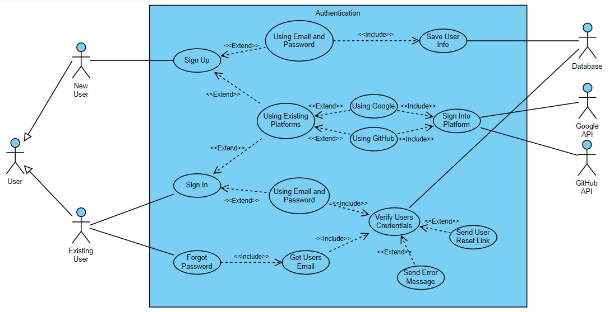
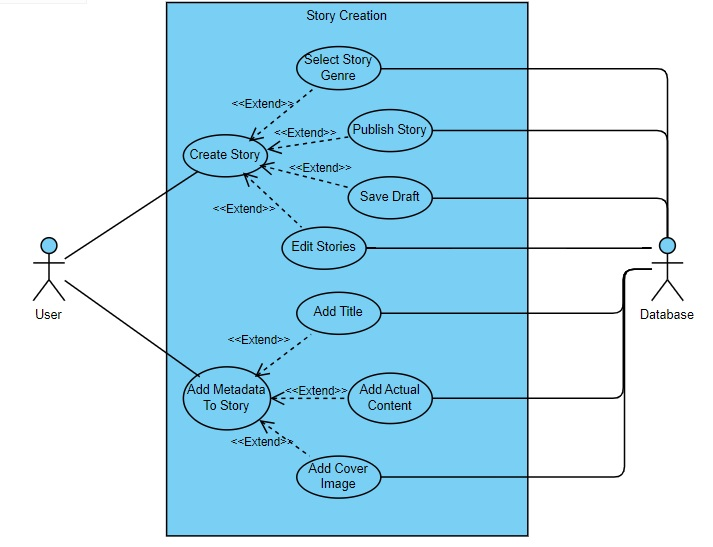
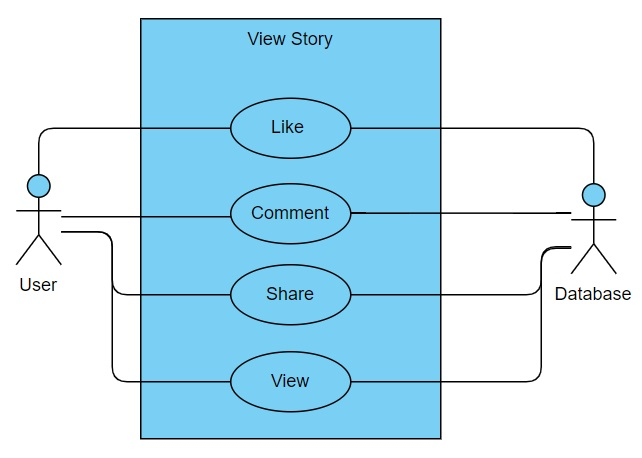
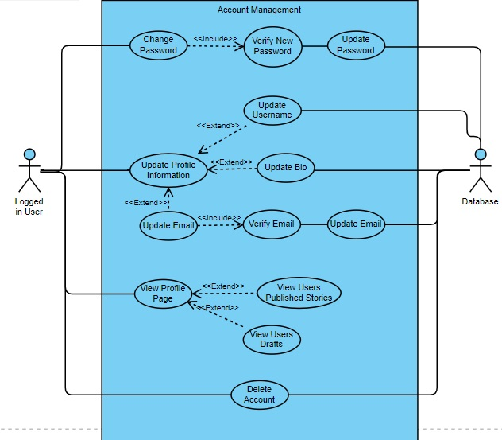
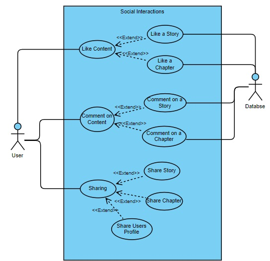
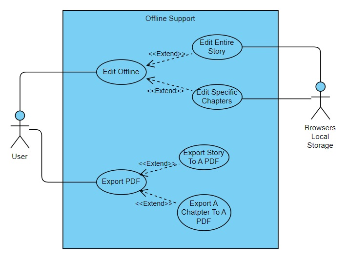
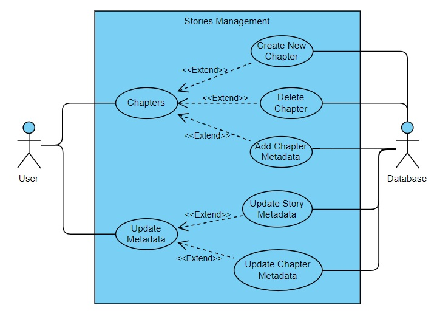

# Software Requirements Specification

## Introduction

WriteMe is an innovative platform designed to revolutionize the way people create, share, and consume stories. Our vision is to become the leading platform for writers and readers, providing tools and features that enhance the storytelling experience and make it accessible to everyone. WriteMe aims to enhance user experience through an intuitive and seamless interface, foster creativity by offering helpful tools and suggestions, build a vibrant community for sharing and feedback, ensure security with robust measures to protect user data, and expand accessibility across various devices and operating systems.

The rise of digital content consumption has created a demand for platforms that not only allow users to consume content but also to create and share their own. WriteMe addresses this need by offering a dedicated space for writers to craft stories and for readers to discover new and diverse content. The project scope includes developing a web-based platform with features such as user registration and authentication with multiple login options, a secure story creation and editing interface, simple publishing processes, community features for exploring and engaging with stories, and customization options like dark mode. Comprehensive testing and performance optimization ensure a fast and reliable user experience. WriteMe is poised to meet the growing demand for high-quality, user-generated content in a secure and accessible manner

## Functional Requirements

### Authentication

<ol className="srs-bullets">
  <li>The users must be able to sign up  
    <ol className="srs-bullets">
      <li>Using a sign up form. The form should gather the following:
        <ol className="srs-bullets">
          <li><strong>Email address. Does not require email authentication.</strong></li>
          <li>Date of birth</li>
          <li><strong>Password</strong></li>
          <li>Username</li>
        </ol>
       </li>
      <li>Using existing platforms:
        <ol className="srs-bullets">
          <li><strong>Google</strong></li>
          <li><strong>Github</strong></li>
        </ol>
      </li>
      <li> After signing up, the system must obtain the following from the user:
        <ol className="srs-bullets">
          <li>Gender</li>
          <li>Name and Surname</li>
          <li>Language</li>
        </ol>
      </li>
    </ol>
  </li>
  <li>The user must be able to sign in
    <ol className="srs-bullets">
      <li>Using their email and password
        <ol className="srs-bullets">
          <li><strong>The user credentials must be validated</strong></li>
          <li>Must allow user to recover their password using their email or username
            <ol className="srs-bullets">
              <li>The account must be verified (i.e. ensure it exists)</li>
              <li>If the account is found, the system must allow the user to send a recovery email to the email address associated with the account</li>
            </ol>
          </li>
        </ol>
      </li>
      <li>Using existing platforms
        <ol className="srs-bullets">
          <li><strong>Using Google</strong></li>
          <li><strong>Using Github</strong></li>
        </ol>
      </li>
      <li>The user must be able to select “forgot password’
        <ol className="srs-bullets">
          <li>The system must identify their account using their email address or username.</li>
          <li>If an account is found, a button appears that lets the user send a password reset email to the email address linked to their account</li>
        </ol>
      </li>
    </ol>
  </li>
</ol>

### Authorization

<ol className="srs-bullets">
  <li>The system must provide functionality that is specific to users that are singed up:
    <ol className="srs-bullets">
      <li><strong>Access to account management</strong></li>
      <li><strong>Access to reading other stories</strong></li>
      <li><strong>Access to writing stories</strong></li>
      <li>Access to the recommendation system. The access is implicit (i.e. the user doesn't directly interact with the system)</li>
      <li>Access to the social interaction system*</li>
    </ol>
  </li>
</ol>

### Story Creation

<ol className="srs-bullets">
  <li>Users must be able to create their own stories:
    <ol className='srs-bullets'>
      <li><strong>Users must be able to publish their story</strong></li>
      <li><strong>Users must be able to save their story to a draft</strong></li>
      <li><strong>Users must be able to edit their stories</strong></li>
      <li>Genre selection</li>
    </ol>
  </li>
  <li>Metadata:
    <ol className='srs-bullets'>
      <li><strong>Users must be able to add a title to their story</strong></li>
      <li><strong>Editor for users to write the main content of their story</strong></li>
      <li>Able to select a cover image</li>
    </ol>
  </li>
</ol>

### Explore Page\*

<ol className="srs-bullets">
  <li>Users must be able to view other stories:
    <ol className='srs-bullets'>
      <li>Stories can be displayed as thumbnails with the cover image, title and author</li>
      <li>Stories can be displayed as lists with more detailed information such as a short description, genre or publication date</li>
    </ol>
  </li>
  <li>Story filters
    <ol className='srs-bullets'>
      <li>Allow users to filter stories by genre</li>
      <li>Allow users to filter stories by popularity</li>
      <li>Allow users to filter stories by most recently published</li>
    </ol>
  </li>
  <li>Search functionality
    <ol className='srs-bullets'>
      <li>Allow users to search stories by title</li>
      <li>Allow users to search stories by author</li>
      <li>Allow users to search stories with keywords</li>
    </ol>
  </li>
</ol>

### Social Interaction

<ol className="srs-bullets">
  <li>Users must be able to interact with published stories
    <ol className='srs-bullets'>
      <li> Users can comment on different features:
        <ol className='srs-bullets'>
          <li>Users can comment on Entire Stories</li>
          <li>Users can comment on Chapters</li>
          <li>Users can comment on Blocks</li>
        </ol>
      </li>
      <li>Users can like differnet sections
        <ol className='srs-bullets'>
          <li>Users can like Entire Stories</li>
          <li>Users can like Chapters</li>
        </ol>
      </li>
    </ol>
  </li>
</ol>

### Sharing

<ol className="srs-bullets">
  <li>Users can share stories in different ways:
      <ol className='srs-bullets'>
        <li>Users can share via Whatsapp</li>
        <li>Users can share via Email </li>
        <li>Users can share on Pinterest</li>
        <li>Users can share on Facebook</li>
     </ol>
    </li>
    <li>Users can export stories to PDF</li>
</ol>

### Account Management

<ol className="srs-bullets">
  <li>The system must provide functionality that is specific to users that have an existing account:
      <ol className='srs-bullets'>
        <li>Users should be able to change their credentials
          <ol className="srs-bullets">
            <li>Users should be able to change their password</li>
            <li>Users should be able to change their email</li>
          </ol>
        </li>
        <li>Users should be able to update their infromation
          <ol className="srs-bullets">
            <li>Users should be able to update bio</li>
            <li>Users should be able to update name</li>
          </ol>
        </li>
        <li>Users should be able to delete their account</li>
      </ol>
    </li>

</ol>

## Architectural Requirements

### Quality Requirements

<ol className="srs-bullets">
  <li>Security
    <ol className='srs-bullets'>
      <li>Users can only access an account by entering the correct email and password</li>
      <li>Passwords will be stored, salt added and hashed</li>
      <li>Users cannot create an account until they have given a strong password</li>
    </ol>
  </li>
  <li>Compatibility
    <ol className='srs-bullets'>
      <li>The app will be able to function across a variety of devices, web browsers and operating systems</li>
    </ol>
  </li>
  <li>Reliability
    <ol className='srs-bullets'>
      <li>Testing and Performance
        <ol className='src-bullets'>
          <li>Thorough testing procedures using unit tests, integration tests and system tests to identify bugs before deployment using Playwright and vTest with atleast 90% coverage</li>
          <li>Use of automated testing tools such as Google Lighthouse to test the systems performance and functionality.</li>
          <li>The app must peform consistenly at all times.</li>
          <li>The app must implement robust error handling mechanisms.</li>
        </ol>
      </li>
      <li>Data Accuracy and Consistency
        <ol className='src-bullets'>
          <li>Implement data validation mechanisms to ensure that user input is accurate and consistent.</li>
          <li>Enforce data validation rules and constraints at the application level to prevent invalid or incomplete data from entering the system.</li>
          <li>Use transaction management techniques to maintain data integrity and consistency, such as atomicity, consistency, isolation, and durability (ACID) properties in database operations.</li>
        </ol>
      </li>
    </ol>
  </li>
  <li>Efficiency
    <ol className='srs-bullets'>
      <li>The app will need to be fast and responsive</li>
      <li>The app will not have unneccesary overhead that can cause delays</li>
      <li>The app will need to have minimal load times and retrieval processes</li>
    </ol>
  </li>
  <li>Usability
    <ol className='srs-bullets'>
      <li>Clear and Intuitive Interface
        <ol className='srs-bullets'>
          <li>Simplify the interface by removing unnecessary clutter and organising information logically and intuitively.</li>
          <li>Use consistent design patterns and terminology throughout the platform to reduce cognitive load and improve user comprehension.</li>
          <li>Provide clear visual cues, such as buttons, icons, and labels, to guide users through the interface and indicate interactive elements.</li>
        </ol>
      </li>
      <li>User-Friendly Navigation
        <ol className='srs-bullets'>
          <li>Design an intuitive navigation structure that allows users to easily find and access the platform's features and functionalities.</li>
          <li>Use hierarchical menu structures, breadcrumbs, and navigation bars to provide clear pathways for users to navigate between different sections of the platform.</li>
        </ol>
      </li>
    </ol>
  </li>
</ol>

### Architectural Pattern

### Client-Server Pattern

The Client-Server architecture for our project splits the application into two main components being the client and the server. The client is a Progressive Web App built with React and provides an interactive and responsive user interface that can be accessed and used across multiple devices. Users actions such as creating and writing stories are sent as HTTP requests to the server. The server, developed using NestJS, handles these requests by processing the data, applying NLP techniques, and managing the business logic. All of our data is stored in a database therefore ensuring persistence and reliability.CI/CD using GitHub actions make updates and maintenance fast and efficient. This architecture ensures a robust, scalable, and secure platform, therefore creating a simple yet effective writing experience for users

## Use Case Diagrams

### Authentication System



### Story Creation System



### View Story System



### Account Management System



### Social Interactions System



### Offline System



### Stories Management System



## Technology Requirements

### Mono Repository Management

- **nx:** 
  - **Advantage:** Provides efficient code sharing and dependency management across multiple projects, ensuring streamlined development and maintenance.

### Framework

- **Next.js:** 
  - **Advantage:** Offers server-side rendering and static site generation, improving performance and SEO for the application.

### Unit / Integration Testing

- **Jest:** 
  - **Advantage:** Delivers fast and reliable testing with a comprehensive feature set, ensuring high code quality and coverage.

### End-to-End / Integration Testing

- **Playwright:** 
  - **Advantage:** Provides cross-browser testing capabilities, ensuring compatibility and functionality across different web browsers.

### Linting

- **ESLint:** 
  - **Advantage:** Helps maintain code quality and consistency by identifying and fixing potential issues and enforcing coding standards.

### Documentation: Inline

- **JSDoc:** [jsdoc](https://jsdoc.app/)
  - **Advantage:** Enhances code readability and maintainability by providing inline documentation for developers.

### Documentation: Wiki

- **Markdown:** [markdown](https://www.markdownguide.org/)
  - **Advantage:** Allows for easy creation and editing of documentation, making it accessible and collaborative.

### Documentation: Design and Wireframes

- **Figma:** 
  - **Advantage:** Enables collaborative design and prototyping, ensuring clear communication and visual consistency.

### Documentation: Components

- **Storybook:** [Storybook](https://storybook.js.org/)
  - **Advantage:** Facilitates the development and testing of UI components in isolation, improving component reusability and reliability.

### Deployment

- **AWS:** 
  - **Advantage:** Offers scalable and reliable cloud infrastructure with a wide range of services to support application deployment and management.
- **Cloudflare Pages:** 
  - **Advantage:** Provides fast and secure web hosting with built-in CDN and DDoS protection, enhancing site performance and security.

### Package Manager

- **pnpm:** [pnpm](https://pnpm.io/)
  - **Advantage:** Ensures faster and more efficient package installation and management, reducing disk space usage.

### Local Development

- **WSL:**
  - **Advantage:** Allows seamless integration of Linux-based development environments on Windows, enhancing productivity and compatibility.
- **Docker:** 
  - **Advantage:** Provides consistent development and testing environments through containerization, ensuring smooth deployment across different systems.

### Commit Standards

- **Conventional Commits:** [Conventional Commits](https://www.conventionalcommits.org/en/v1.0.0/)
  - **Advantage:** Promotes structured and meaningful commit messages, facilitating better versioning and project history tracking.

## Project Structure

```shell
.
├── apps
│   ├── writeme #Nextjs app
│   │   ├── app
│   │   │   └── api # additional api routes
│   │   ├── public
│   │   └── specs
│   ├── writeme-docs # documentation website
│   │   ├── docs
│   │   ├── guides
│   │   ├── src
│   │   │   ├── components
│   │   │   ├── css
│   │   │   └── pages
│   │   └── static
│   │       └── img
│   └── writeme-e2e # end-to-end tests for writeme app
│       └── src
├── wmc  # components library
│   └── src
└── wmc-utils # utilities for components library
    └── src
```

## User Stories

#### As a New User I would like to:

<ul className='newUserStories'>
  <li>Sign up with Google so it is faster and easier to sign up</li>
  <li>Sign up with GitHub so it is faster and easier to sign up</li>
  <li>Sign up with an email and password so I can use all of WriteMe's features</li>
</ul>

#### As a Guest I would like to:

<ul className='guestStories'>
  <li>View all of the published stories</li>
  <li>Read any of the published stories</li>
  <li>Select a username so I can view that user's account information and stories by that user</li>
</ul>

#### As an Existing User I would like to:

<ul className='existingUserStories'>
  <li>Sign in with Google so it is faster and easier to sign in</li>
  <li>Sign in with GitHub so it is faster and easier to sign in</li>
  <li>Sign in with an email and password so I can use all of WriteMe's features</li>
  <li>Select a story genre so I can create a story with this genre</li>
  <li>Publish my story so others can view and interact with it</li>
  <li>Save my story as a draft so I can carry on with it at another time without losing any of my story</li>
  <li>Edit my story so I can make any changes I think of at a later stage</li>
  <li>Add a title to my story so it is clear what the story is about</li>
  <li>Write my story in a helpful and easy to use editor so that my experience is fast, simple and enjoyable</li>
  <li>Add a cover image for my story so I can identify my different stories and associate them with cover images</li>
  <li>View a story so I can read other peoples stories and get inspiration for some of my own stories</li>
  <li>Like a story so I can show my appreciation for a good story</li>
  <li>Comment on a story so I can share my thoughts and receive feedback from others</li>
  <li>Share a story on WhatsApp so I can show others the story</li>
  <li>Create a new chapter so I can have a multi-chapter story</li>
  <li>Enter a new username so I can change my current username</li>
  <li>The app to be a PWA that caches images and stories so I can read stories offline</li>
  <li>Click a button that shares a story to Pinterest so I can share a story to Pinterest easily</li>
  <li>Be able to comment on a chapter of a story so I can give an author feedback</li>
  <li>A form so I can update a already created story's metadata</li>
  <li>Share my editor in realtime so I can get help and feedback from other authors in realtime</li>
  <li>Select a username so I can view that user's account information and stories by that user</li>
</ul>

## Constraints

<ol>
    <li>Technical Constraints:
        <ul>
            <li>Scalability: Ensuring the system can handle a growing number of users and data without compromising performance.</li>
            <li>Integration of AI: Implementing sophisticated NLP algorithms and AI-driven suggestions requires significant computational resources and expertise.</li>
            <li>Cross-Device Compatibility: Developing a PWA that functions seamlessly across various devices (phones, tablets, laptops) can be challenging.</li>
        </ul>
    </li>
    <li>Resource Constraints:
        <ul>
            <li>Development Time: Limited time frame to develop, test, and deploy the application.</li>
            <li>Budget: Financial limitations may affect the choice of technologies, cloud services, and AI tools.</li>
            <li>Human Resources: Availability of skilled developers proficient in frontend, backend, AI, and cloud technologies.</li>
        </ul>
    </li>
    <li>Security Constraints:
        <ul>
            <li>Data Protection: Ensuring user data, including personal information and creative content, is securely stored and transmitted.</li>
            <li>Compliance: Adhering to data privacy regulations such as GDPR.</li>
        </ul>
    </li>
    <li>Operational Constraints:
        <ul>
            <li>Continuous Deployment: Managing frequent updates and maintaining system stability during CI/CD processes.</li>
            <li>Server Maintenance: Ensuring reliable server performance and uptime, especially during high traffic periods.</li>
        </ul>
    </li>
    <li>User Constraints:
        <ul>
            <li>User Adoption: Encouraging writers to adopt and consistently use the platform.</li>
            <li>Learning Curve: Ensuring the platform is intuitive and easy to use for writers of varying technical proficiency.</li>
        </ul>
    </li>
    <li>Market Constraints:
        <ul>
            <li>Competition: Differentiating WriteMe from existing writing and collaboration tools.</li>
            <li>Market Penetration: Effectively reaching and engaging the target audience of writers and creative professionals.</li>
        </ul>
    </li>
</ol>

## Service Contracts

### POST /register (Create User):

**Description:**

This endpoint allows the creation of a new user account.

**Request:**

- **Method:** `POST`
- **Path:** `/register`
- **Body:**

```json
{
  "name": "string",
  "email": "string",
  "password": "string"
}
```

**Response:**

- **Success (200 OK):**

```json
{
  "user": {
    "name": "string",
    "email": "string"
  }
}
```

- **Bad Request (400 Bad Request):**

```json
{
  "status": "error",
  "message": "Validation failed",
  "errors": []
}
```

- **Conflict (409 Conflict): Email already exists**

```json
{
  "status": "fail",
  "message": "user with that email already exists"
}
```

- **Internal Server Error (500 Internal Server Error):**

```json
{
  "status": "error",
  "message": "'Internal Server Error'"
}
```

### PUT /story (Update Story):

**Description:**

This endpoint allows an authenticated user to update a story they own.

**Request:**

- **Method:** `PUT`
- **Path:** `/story`
- **Headers:**
  - `Authorization`: Bearer token containing user's session information
  - `Content-Type`: application/json
- **Body:**

```json
{
  "story": {
    "id": "string"
  },
  "content": "string",
  "brief": "string",
  "tite": "string",
  "description": "string",
  "blocks": [],
  "published": true
}
```

**Response:**

- **Headers:**
  - `Content-Type`: application/json
- **Body:**

```json
{
  "story": {
    "id": "string"
  }
}
```

### POST /story (Create Story):

**Description:**

This endpoint allows an authenticated user to create a new story.

**Request:**

- **Method:** `POST`
- **Path:** `/story`
- **Headers:**
  - `Authorization`: Bearer token containing user's session information
  - `Content-Type`: application/json
- **Body:**

```json
{
  "userId": "string",
  "content": "string",
  "brief": "string",
  "tite": "string",
  "description": "string",
  "blocks": []
}
```

**Response:**

- **Headers:**
  - `Content-Type`: application/json
- **Body:**

```json
{
  "story": {
    "id": "string"
  }
}
```

## Class Diagram


