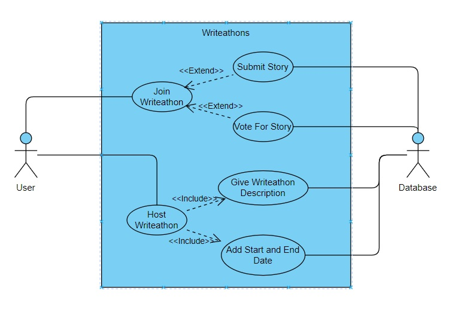
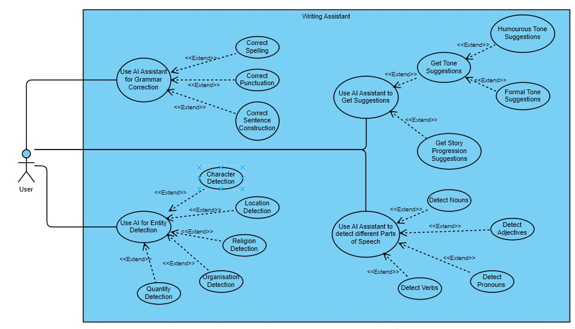
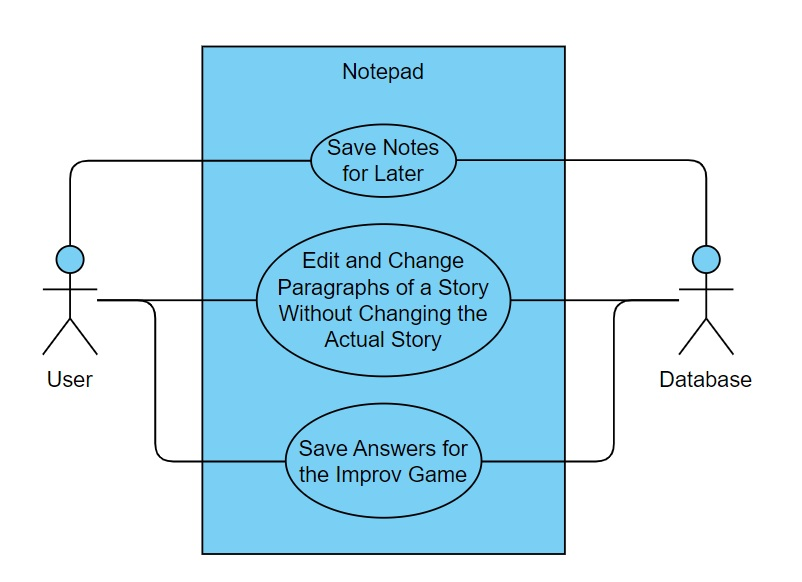

# Software Requirements Specification

## Introduction

WriteMe is an innovative platform designed to revolutionize the way people create, share, and consume stories. Our vision is to become the leading platform for writers and readers, providing tools and features that enhance the storytelling experience and make it accessible to everyone. WriteMe aims to enhance user experience through an intuitive and seamless interface, foster creativity by offering helpful tools and suggestions, build a vibrant community for sharing and feedback, ensure security with robust measures to protect user data, and expand accessibility across various devices and operating systems.

The rise of digital content consumption has created a demand for platforms that not only allow users to consume content but also to create and share their own. WriteMe addresses this need by offering a dedicated space for writers to craft stories and for readers to discover new and diverse content. The project scope includes developing a web-based platform with features such as user registration and authentication with multiple login options, a secure story creation and editing interface, simple publishing processes, community features for exploring and engaging with stories, and customization options like dark mode. Comprehensive testing and performance optimization ensure a fast and reliable user experience. WriteMe is poised to meet the growing demand for high-quality, user-generated content in a secure and accessible manner

## Functional Requirements

<strong> All points in bold are requirements that have been implemented already and points that are not bolded are what we plan to do next</strong>

### Authentication

<ol className="srs-bullets">
  <li>The users must be able to sign up  
    <ol className="srs-bullets">
      <li>Using a sign up form. The form should gather the following:
        <ol className="srs-bullets">
          <li><strong>Email address. Does not require email authentication.</strong></li>
          <li><strong>Date of birth</strong></li>
          <li><strong>Password</strong></li>
          <li><strong>Username</strong></li>
        </ol>
       </li>
      <li>Using existing platforms:
        <ol className="srs-bullets">
          <li><strong>Google</strong></li>
          <li><strong>Github</strong></li>
        </ol>
      </li>
    </ol>
  </li>
  <li>The user must be able to sign in
    <ol className="srs-bullets">
      <li>Using their email and password
        <ol className="srs-bullets">
          <li><strong>The user credentials must be validated</strong></li>
          <li>Must allow user to recover their password using their email or username
            <ol className="srs-bullets">
              <li><strong>The account must be verified (i.e. ensure it exists)</strong></li>
              <li><strong>If the account is found, the system must allow the user to send a recovery email to the email address associated with the account</strong></li>
            </ol>
          </li>
        </ol>
      </li>
      <li>Using existing platforms
        <ol className="srs-bullets">
          <li><strong>Using Google</strong></li>
          <li><strong>Using Github</strong></li>
        </ol>
      </li>
      <li>The user must be able to select “forgot password’
        <ol className="srs-bullets">
          <li><strong>The system must identify their account using their email address or username.</strong></li>
          <li><strong>If an account is found, a button appears that lets the user send a password reset email to the email address linked to their account</strong></li>
        </ol>
      </li>
    </ol>
  </li>
</ol>

### Authorization

<ol className="srs-bullets">
  <li>The system must provide functionality that is specific to users that are singed up:
    <ol className="srs-bullets">
      <li><strong>Access to account management</strong></li>
      <li><strong>Access to reading other stories</strong></li>
      <li><strong>Access to writing stories</strong></li>
      <li><strong>Access to the recommendation system. The access is implicit (i.e. the user doesn't directly interact with the system)</strong></li>
      <li><strong>Access to the social interaction system</strong></li>
    </ol>
  </li>
</ol>

### Story Creation

<ol className="srs-bullets">
  <li>Users must be able to create their own stories:
    <ol className='srs-bullets'>
      <li><strong>Users must be able to publish their story</strong></li>
      <li><strong>Users must be able to save their story to a draft</strong></li>
      <li><strong>Users must be able to edit their stories</strong></li>
      <li><strong>Genre selection</strong></li>
    </ol>
  </li>
  <li>Metadata:
    <ol className='srs-bullets'>
      <li><strong>Users must be able to add a title to their story</strong></li>
      <li><strong>Editor for users to write the main content of their story</strong></li>
      <li><strong>Able to select a cover image</strong></li>
    </ol>
  </li>
</ol>

### Explore Page

<ol className="srs-bullets">
  <li>Users must be able to view other stories:
    <ol className='srs-bullets'>
      <li><strong>Stories can be displayed as thumbnails with the cover image, title and author</strong></li>
      <li>Stories can be displayed as lists with more detailed information such as a short description, genre or publication date</li>
    </ol>
  </li>
  <li>Story filters
    <ol className='srs-bullets'>
      <li>Allow users to filter stories by genre</li>
      <li>Allow users to filter stories by popularity</li>
      <li>Allow users to filter stories by most recently published</li>
    </ol>
  </li>
  <li>Search functionality
    <ol className='srs-bullets'>
      <li><strong>Allow users to search stories by title</strong></li>
      <li><strong>Allow users to search stories by author</strong></li>
      <li><strong>Allow users to search stories with keywords</strong></li>
    </ol>
  </li>
</ol>

### Social Interaction

<ol className="srs-bullets">
  <li>Users must be able to interact with published stories
    <ol className='srs-bullets'>
      <li> Users can comment on different features:
        <ol className='srs-bullets'>
          <li><strong>Users can comment on Entire Stories</strong></li>
          <li><strong>Users can comment on Chapters</strong></li>
        </ol>
      </li>
      <li>Users can like differnet sections
        <ol className='srs-bullets'>
          <li><strong>Users can like Entire Stories</strong></li>
          <li><strong>Users can like Chapters</strong></li>
        </ol>
      </li>
    </ol>
  </li>
</ol>

### Sharing

<ol className="srs-bullets">
  <li>Users can share stories in different ways:
      <ol className='srs-bullets'>
        <li><strong>Users can share via Whatsapp</strong></li>
        <li><strong>Users can share via Email</strong></li>
        <li><strong>Users can share on Pinterest</strong></li>
        <li><strong>Users can share on Facebook</strong></li>
     </ol>
    </li>
    <li><strong>Users can export stories to PDF</strong></li>
</ol>

### Account Management

<ol className="srs-bullets">
  <li>The system must provide functionality that is specific to users that have an existing account:
      <ol className='srs-bullets'>
        <li>Users should be able to change their credentials
          <ol className="srs-bullets">
            <li><strong>Users should be able to change their password</strong></li>
            <li><strong>Users should be able to change their email</strong></li>
          </ol>
        </li>
        <li>Users should be able to update their infromation
          <ol className="srs-bullets">
            <li><strong>Users should be able to update bio</strong></li>
            <li><strong>Users should be able to update name</strong></li>
          </ol>
        </li>
        <li><strong>Users should be able to delete their account</strong></li>
      </ol>
    </li>

</ol>

### Offline Support

<ol className="srs-bullets">
  <li>Users can edit content while offline:
      <ol className='srs-bullets'>
        <li>Users can edit entire stories while offline</li>
        <li>Users can edit specific chapters while offline</li>
     </ol>
  </li>
  <li>Users can export content to a PDF:
    <ol className='srs-bullets'>
      <li><strong>Users can export a Story to a PDF</strong></li>
      <li><strong>Users can export a Chapter to a PDF</strong></li>
    </ol>
  </li>
   
</ol>

### Writeathons

<ol className="srs-bullets">
  <li>Users can participate in existing Writeathons:
      <ol className='srs-bullets'>
        <li><strong>Users can see a list of all active writeathons</strong></li>
        <li><strong>Users can join a writeathon</strong></li>
        <li><strong>Users can submit a story to the writeathon</strong></li>
        <li><strong>Users can vote on whos stroy should win the writeathon</strong></li>
        <li><strong>Users can receive writeathon points for winning writeathons</strong></li>
        <li><strong>Users can </strong></li>
     </ol>
    </li>
  <li>Users can host their own Writeathons
    <ol className='srs-bullets'>
        <li><strong>Users can choose what the writeathon is about</strong></li>
        <li><strong>Users can can decide the start and end date of the writeathon</strong></li>
     </ol>
  </li>
</ol>

### Improv Game

<ol className="srs-bullets">
  <li>Users can play the improv game while writing stories
      <ol className='srs-bullets'>
        <li><strong>Users can choose from a variety of questions to answer</strong></li>
        <li><strong>Users can see their current improve in the suggestion cards</strong></li>
        <li><strong>Users can copy their answers into the clipboard to add to the story</strong></li>
     </ol>
  </li>  
</ol>

### Writing Assistant

<ol className="srs-bullets">
  <li>Users can use the AI assistant for grammar correction
    <ol className='srs-bullets'>
      <li><strong>Users can use the assistant to correct punctuation errors</strong></li>
      <li><strong>Users can use the assistant to correct spelling</strong></li>
      <li><strong>Users can use the assistant to correct sentence construction</strong></li>
    </ol>
  </li>
  <li>Users can use the AI assistant for entity detection
    <ol className='srs-bullets'>
      <li><strong>Users can use the assistant for charachter detection</strong></li>
      <li><strong>Users can use the assistant for location detection</strong></li>
      <li><strong>Users can use the assistant for organisation detection</strong></li>
      <li><strong>Users can use the assistant for religion detection</strong></li>
      <li><strong>Users can use the assistant for quantity detection</strong></li>
    </ol>
  </li>
  <li>Users can use the AI assistant to get suggestions
    <ol className='srs-bullets'>
      <li><strong>Users can use the assistant to get paraphrase suggestions</strong></li>
      <li><strong>Users can use the assistant to generate story progression ideas</strong></li>
    </ol>
  </li>
  <li><strong>Users can use the AI assistant for parts of speech detection</strong></li>
</ol>

### Notepad

<ol className="srs-bullets">
  <li>Users can use the notepad to help with writing stories
      <ol className='srs-bullets'>
        <li><strong>Users can keep notes for later</strong></li>
        <li><strong>Users can save answers for the improv game</strong></li>
        <li><strong>Users can edit and change certain paragraphs to see how they would look without changing the story</strong></li>
        <li><strong>Users can save the notepad to local storage</strong></li>
        <li><strong>Users can load previously saved notepad content from local storage</strong></li>
     </ol>
  </li>  
</ol>

## Architectural Requirements

### Quality Requirements

<ol className="srs-bullets">
  <li><strong>Compatibility</strong>
    <br></br>
    compatibility is important to the application, in order to allow the growth of the community by lowering the barrier to entry.
    <ol className='srs-bullets'>
      <li>The app will be able to function across a variety of devices, web browsers and operating systems</li>
      <li>Should be easy to use on a variety of screen sizes.</li>
    </ol>
    <br></br>
    In order to achieve high compatibility the app should be tested on a wide variety of browsers ,using playwright, a variaty of screen sizes and operating systems should also be targeted using github actions.
  </li>
  <li><strong>Usability</strong>
    <br></br>
    Usability is particularly important to us, as our app should be simple to use in order to allow the user to focus on what they really want to do, reading and writing.
    <ol className='srs-bullets'>
      <li>Clear and Intuitive Interface
        <ol className='srs-bullets'>
          <li>Simplify the interface by removing unnecessary clutter and organising information logically and intuitively.</li>
          <li>Use consistent design patterns and terminology throughout the platform to reduce cognitive load and improve user comprehension.</li>
          <li>Provide clear visual cues, such as buttons, icons, and labels, to guide users through the interface and indicate interactive elements.</li>
        </ol>
      </li>
      <li>User-Friendly Navigation
        <ol className='srs-bullets'>
          <li>Design an intuitive navigation structure that allows users to easily find and access the platform's features and functionalities.</li>
          <li>Use hierarchical menu structures, breadcrumbs, and navigation bars to provide clear pathways for users to navigate between different sections of the platform.</li>
        </ol>
      </li>
    </ol>
    <br></br>
    Usability will be tested through visual testing with storybook.
  </li>
  <li><strong>Reliability</strong>
    <ol className='srs-bullets'>
      <li>Testing and Performance
        <ol className='src-bullets'>
          <li>Thorough testing procedures using unit tests, integration tests and system tests to identify bugs before deployment using Playwright and vitest with atleast 90% coverage for critical components</li>
          <li>Use of automated testing tools such as Google Lighthouse to test the systems performance and functionality.</li>
          <li>The app must peform consistenly at all times.</li>
          <li>The app must implement robust error handling mechanisms.</li>
        </ol>
      </li>
      <li>Data Accuracy and Consistency
        <ol className='src-bullets'>
          <li>Implement data validation mechanisms to ensure that user input is accurate and consistent.</li>
          <li>Enforce data validation rules and constraints at the application level to prevent invalid or incomplete data from entering the system.</li>
          <li>Use transaction management techniques to maintain data integrity and consistency, such as atomicity, consistency, isolation, and durability (ACID) properties in database operations.</li>
        </ol>
      </li>
    </ol>
  </li>
  <li><strong>Efficiency</strong>
    <br></br>
    <ol className='srs-bullets'>
      <li>The app will need to be fast and responsive</li>
      <li>The app will not have unneccesary overhead that can cause delays</li>
      <li>The app will need to have minimal load times and retrieval processes</li>
    </ol>
  </li>
  <li><strong>Security</strong>
    <br></br>
    As users may write about sensitive topics, we should strive to ensure confidentiality.
    <ol className='srs-bullets'>
      <li>Users can only access an account by entering the correct email and password</li>
      <li>Passwords will be stored, salt added and hashed</li>
      <li>Users cannot create an account until they have given a strong password</li>
    </ol>
  </li>
</ol>

### Architectural Pattern

### Client-Server Pattern

The Client-Server architecture for our project splits the application into two main components being the client and the server. The client is a Progressive Web App built with React and provides an interactive and responsive user interface that can be accessed and used across multiple devices. Users actions such as creating and writing stories are sent as HTTP requests to the server. The server, developed using NestJS, handles these requests by processing the data, applying NLP techniques, and managing the business logic. All of our data is stored in a database therefore ensuring persistence and reliability.CI/CD using GitHub actions make updates and maintenance fast and efficient. This architecture ensures a robust, scalable, and secure platform, therefore creating a simple yet effective writing experience for users

## Use Case Diagrams

### Authentication System


### Story Creation System


### View Story System


### Account Management System


### Social Interactions System


### Offline System


### Stories Management System


### Writeathons System



### AI Assistant System



### Notepad System



### Improv Game System


## Technology Requirements

### Mono Repository Management

- **nx:** 
  - **Advantage:** Provides efficient code sharing and dependency management across multiple projects, ensuring streamlined development and maintenance.

### Framework

- **Next.js:** 
  - **Advantage:** Offers server-side rendering and static site generation, improving performance and SEO for the application.

### Unit / Integration Testing

- **Jest:** 
  - **Advantage:** Delivers fast and reliable testing with a comprehensive feature set, ensuring high code quality and coverage.

### End-to-End / Integration Testing

- **Playwright:** 
  - **Advantage:** Provides cross-browser testing capabilities, ensuring compatibility and functionality across different web browsers.

### Linting

- **ESLint:** 
  - **Advantage:** Helps maintain code quality and consistency by identifying and fixing potential issues and enforcing coding standards.

### Documentation: Inline

- **JSDoc:** [jsdoc](https://jsdoc.app/)
  - **Advantage:** Enhances code readability and maintainability by providing inline documentation for developers.

### Documentation: Wiki

- **Markdown:** [markdown](https://www.markdownguide.org/)
  - **Advantage:** Allows for easy creation and editing of documentation, making it accessible and collaborative.

### Documentation: Design and Wireframes

- **Figma:** 
  - **Advantage:** Enables collaborative design and prototyping, ensuring clear communication and visual consistency.

### Documentation: Components

- **Storybook:** [Storybook](https://storybook.js.org/)
  - **Advantage:** Facilitates the development and testing of UI components in isolation, improving component reusability and reliability.

### Deployment

- **AWS:** 
  - **Advantage:** Offers scalable and reliable cloud infrastructure with a wide range of services to support application deployment and management.
- **Cloudflare Pages:** 
  - **Advantage:** Provides fast and secure web hosting with built-in CDN and DDoS protection, enhancing site performance and security.

### Package Manager

- **pnpm:** [pnpm](https://pnpm.io/)
  - **Advantage:** Ensures faster and more efficient package installation and management, reducing disk space usage.

### Local Development

- **WSL:**
  - **Advantage:** Allows seamless integration of Linux-based development environments on Windows, enhancing productivity and compatibility.
- **Docker:** 
  - **Advantage:** Provides consistent development and testing environments through containerization, ensuring smooth deployment across different systems.

### Commit Standards

- **Conventional Commits:** [Conventional Commits](https://www.conventionalcommits.org/en/v1.0.0/)
  - **Advantage:** Promotes structured and meaningful commit messages, facilitating better versioning and project history tracking.

## Project Structure

```shell
.
├── apps
│   ├── writeme #Nextjs app
│   │   ├── app
│   │   │   └── api # additional api routes
│   │   ├── public
│   │   └── specs
│   ├── writeme-docs # documentation website
│   │   ├── docs
│   │   ├── guides
│   │   ├── src
│   │   │   ├── components
│   │   │   ├── css
│   │   │   └── pages
│   │   └── static
│   │       └── img
│   └── writeme-e2e # end-to-end tests for writeme app
│       └── src
├── wmc  # components library
│   └── src
└── wmc-utils # utilities for components library
    └── src
```

## User Stories

#### A New Users Charachteristics

Any user that has not made a WriteMe account before

#### As a New User I would like to:

<ul className='newUserStories'>
  <li>Sign up with Google so it is faster and easier to sign up</li>
  <li>Sign up with GitHub so it is faster and easier to sign up</li>
  <li>Sign up with an email and password so I can use all of WriteMe's features</li>
</ul>

#### A Guest Users Charachteristics

Any user that would like to explore WriteMe to see what it is about before making an account

#### As a Guest I would like to:

<ul className='guestStories'>
  <li>View all of the published stories</li>
  <li>Read any of the published stories</li>
  <li>Select a username so I can view that user's account information and stories by that user</li>
</ul>

#### An Existing Users Charachteristics

Any user that has made a WriteMe account before

#### As an Existing User I would like to:

<ul className='existingUserStories'>
  <li>Sign in with Google so it is faster and easier to sign in</li>
  <li>Sign in with GitHub so it is faster and easier to sign in</li>
  <li>Sign in with an email and password so I can use all of WriteMe's features</li>
  <li>Select a username so I can view that user's account information and stories by that user</li>
  <li>Enter a new username so I can change my current username</li>
  <li>Change my password to a new password that I would prefer to use</li>
  <li>Update my personal information on my profile so i can keep everything up to date</li>
</ul>

#### A Readers Charachteristics

A WriteMe reader would be someone who devours stories and enjoys getting lost in new worlds. They'd likely be curious and have a strong imagination, appreciating the creativity of others. Active readers might leave comments, offering feedback and fostering connections with the writers. They'd also be open to discovering new voices and genres, making WriteMe a treasure trove for their reading adventures

#### As a Reader I would like to

<ul className='existingUserStories'>  
  <li>View a story so I can read other peoples stories and get inspiration for some of my own stories</li>
  <li>Like a story so I can show my appreciation for a good story</li>
  <li>Comment on a story so I can share my thoughts and receive feedback from others</li>
  <li>Share a story on WhatsApp so I can show others the story</li>
  <li>The app to be a PWA that caches images and stories so I can read stories offline</li>
  <li>Click a button that shares a story to Pinterest so I can share a story to Pinterest easily</li>
  <li>Be able to comment on a chapter of a story so I can give an author feedback</li>
</ul>

#### A Writers Charachteristics

A WriteMe writer would likely be someone with a passion for language and a desire to share their stories. They'd be creative and imaginative, able to craft compelling narratives and develop engaging characters. Patience and perseverance are key, as writers face rejection and refine their work. Additionally, a WriteMe writer would enjoy feedback and thrive in a community of fellow storytellers

#### As a writer I would like to

<ul className='existingUserStories'>
  <li>Select a story genre so I can create a story with this genre</li>
  <li>Publish my story so others can view and interact with it</li>
  <li>Save my story as a draft so I can carry on with it at another time without losing any of my story</li>
  <li>Edit my story so I can make any changes I think of at a later stage</li>
  <li>Add a title to my story so it is clear what the story is about</li>
  <li>Write my story in a helpful and easy to use editor so that my experience is fast, simple and enjoyable</li>
  <li>Add a cover image for my story so I can identify my different stories and associate them with cover images</li>
  <li>Create a new chapter so I can have a multi-chapter story</li>
  <li>A form so I can update a already created story's metadata</li>
  <li>Share my editor in realtime so I can get help and feedback from other authors in realtime</li>
</ul>

## Constraints

<ol>
    <li>Technical Constraints:
        <ul>
            <li>Scalability: Ensuring the system can handle a growing number of users and data without compromising performance.</li>
            <li>Integration of AI: Implementing sophisticated NLP algorithms and AI-driven suggestions requires significant computational resources and expertise.</li>
            <li>Cross-Device Compatibility: Developing a PWA that functions seamlessly across various devices (phones, tablets, laptops) can be challenging.</li>
        </ul>
    </li>
    <li>Resource Constraints:
        <ul>
            <li>Development Time: Limited time frame to develop, test, and deploy the application.</li>
            <li>Budget: Financial limitations may affect the choice of technologies, cloud services, and AI tools.</li>
            <li>Human Resources: Availability of skilled developers proficient in frontend, backend, AI, and cloud technologies.</li>
        </ul>
    </li>
    <li>Security Constraints:
        <ul>
            <li>Data Protection: Ensuring user data, including personal information and creative content, is securely stored and transmitted.</li>
            <li>Compliance: Adhering to data privacy regulations such as GDPR.</li>
        </ul>
    </li>
    <li>Operational Constraints:
        <ul>
            <li>Continuous Deployment: Managing frequent updates and maintaining system stability during CI/CD processes.</li>
            <li>Server Maintenance: Ensuring reliable server performance and uptime, especially during high traffic periods.</li>
        </ul>
    </li>
    <li>User Constraints:
        <ul>
            <li>User Adoption: Encouraging writers to adopt and consistently use the platform.</li>
            <li>Learning Curve: Ensuring the platform is intuitive and easy to use for writers of varying technical proficiency.</li>
        </ul>
    </li>
    <li>Market Constraints:
        <ul>
            <li>Competition: Differentiating WriteMe from existing writing and collaboration tools.</li>
            <li>Market Penetration: Effectively reaching and engaging the target audience of writers and creative professionals.</li>
        </ul>
    </li>
</ol>

## Service Contracts

### POST /register (Create User):

**Description:**

This endpoint allows the creation of a new user account.

**Request:**

- **Method:** `POST`
- **Path:** `/register`
- **Body:**

```json
{
  "name": "string",
  "email": "string",
  "password": "string"
}
```

**Response:**

- **Success (200 OK):**

```json
{
  "user": {
    "name": "string",
    "email": "string"
  }
}
```

- **Bad Request (400 Bad Request):**

```json
{
  "status": "error",
  "message": "Validation failed",
  "errors": []
}
```

- **Conflict (409 Conflict): Email already exists**

```json
{
  "status": "fail",
  "message": "user with that email already exists"
}
```

- **Internal Server Error (500 Internal Server Error):**

```json
{
  "status": "error",
  "message": "'Internal Server Error'"
}
```

### PUT /register (Update User):

**Description:**

This endpoint allows the user to update their profile.

**Request:**

- **Method:** `PUT`
- **Path:** `/register`
- **Body:**

```json
{
  "name": "string",
  "email": "string",
  "bio": "string",
  "password": "string"
}
```

**Response:**

- **Success (200 OK):**

```json
{
  "user": {
    "name": "string",
    "email": "string"
  }
}
```

- **Bad Request (400 Bad Request):**

```json
{
  "status": "error",
  "message": "Validation failed",
  "errors": []
}
```

- **Conflict (409 Conflict): Email already exists**

```json
{
  "status": "fail",
  "message": "user with that email already exists"
}
```

- **Internal Server Error (500 Internal Server Error):**

```json
{
  "status": "error",
  "message": "'Internal Server Error'"
}
```

### PUT /story (Update Story):

**Description:**

This endpoint allows an authenticated user to update a story they own.

**Request:**

- **Method:** `PUT`
- **Path:** `/story`
- **Headers:**
  - `Authorization`: Bearer token containing user's session information
  - `Content-Type`: application/json
- **Body:**

```json
{
  "story": {
    "id": "string"
  },
  "content": "string",
  "brief": "string",
  "tite": "string",
  "description": "string",
  "blocks": [],
  "published": true,
  "cover": "string"
}
```

**Response:**

- **Headers:**
  - `Content-Type`: application/json
- **Body:**

```json
{
  "story": {
    "id": "string"
  }
}
```

### POST /story (Create Story):

**Description:**

This endpoint allows an authenticated user to create a new story.

**Request:**

- **Method:** `POST`
- **Path:** `/story`
- **Headers:**
  - `Authorization`: Bearer token containing user's session information
  - `Content-Type`: application/json
- **Body:**

```json
{
  "userId": "string",
  "content": "string",
  "brief": "string",
  "tite": "string",
  "description": "string",
  "blocks": [],
  "cover": "string"
}
```

**Response:**

- **Headers:**
  - `Content-Type`: application/json
- **Body:**

```json
{
  "story": {
    "id": "string"
  }
}
```

### POST /chapter (Create a chapter)

**Description:**

This endpoint allows an authenticated user to create a new chapter for their story.

**Request:**

- **Method:** `POST`
- **Path:** `/chapter`
- **Headers:**
  - `Authorization`: Bearer token containing user's session information
  - `Content-Type`: application/json
- **Body:**

```json
{
  "storyId": "string",
  "content": "string",
  "brief": "string",
  "tite": "string",
  "description": "string",
  "blocks": [],
  "cover": "string"
}
```

**Response:**

- **Success (200 OK)**

```json
{
  "chapterId": "string"
}
```

- **Unauthenticated (401 Unauthorised)**

```json
{
  "status": "fail",
  "message": "You are not logged in"
}
```

- **Validation Error (400 Bad Request)**

```json
{
  "status": "error",
  "message": "Validation failed",
  "errors": []
}
```

- **Internal Server Error (500 Internal Server Error)**

```json
{
  "status": "error",
  "message": "Internal Server Error"
}
```

### PUT /chapter (Update a chapter)

**Description:**

This endpoint allows an authenticated user to create a new chapter for their story.

**Request:**

- **Method:** `PUT`
- **Path:** `/chapter`
- **Headers:**
  - `Authorization`: Bearer token containing user's session information
  - `Content-Type`: application/json
- **Body:**

```json
{
  "content": "string",
  "brief": "string",
  "tite": "string",
  "description": "string",
  "blocks": [],
  "cover": "string",
  "order": 0
}
```

**Response:**

- **Success (200 OK)**

```json
{
  "story": {
    "chapterId": "string"
  }
}
```

- **Unauthenticated (401 Unauthorised)**

```json
{
  "status": "fail",
  "message": "You are not logged in"
}
```

- **Validation Error (400 Bad Request)**

```json
{
  "status": "error",
  "message": "Validation failed",
  "errors": []
}
```

- **Internal Server Error (500 Internal Server Error)**

```json
{
  "status": "error",
  "message": "Internal Server Error"
}
```

### POST /likes (like/unlike a chapter/story):

**Description:**

This endpoint allows an authenticated user to like a chapter or story.

**Request:**

- **Method:** `POST`
- **Path:** `/likes`
- **Headers:**
  - `Authorization`: Bearer token containing user's session information
  - `Content-Type`: application/json
- **Body:**

```json
{
  "storyId": "string",
  "chapterId": "string"
}
```

**Response:**

- **Success (200 OK)**

```json
{
  "liked": true
}
```

- **Unauthenticated (401 Unauthorised)**

```json
{
  "status": "fail",
  "message": "You are not logged in"
}
```

### POST /follow (follow/unfollow a user):

**Description:**

This endpoint allows an authenticated user to follow another user.

**Request:**

- **Method:** `POST`
- **Path:** `/follow`
- **Headers:**
  - `Authorization`: Bearer token containing user's session information
  - `Content-Type`: application/json
- **Body:**

```json
{
  "userId": "string",
  "followedUser": "string"
}
```

**Response:**

- **Success (200 OK)**

```json
{
  "followed": true
}
```

- **Unauthenticated (401 Unauthorised)**

```json
{
  "status": "fail",
  "message": "You are not logged in"
}
```

- **Internal Server Error (500 Internal Server Error)**

```json
{
  "status": "error",
  "message": "Internal Server Error"
}
```

### POST /comments (comment on a story or chapter):

**Description:**

This endpoint allows an authenticated comment on a story or chapter.

**Request:**

- **Method:** `POST`
- **Path:** `/comments`
- **Headers:**
  - `Authorization`: Bearer token containing user's session information
  - `Content-Type`: application/json
- **Body:**

```json
{
  "userId": "string",
  "storyId": "string",
  "chapterId": "string",
  "content": "string"
}
```

**Response:**

- **Success (200 OK)**

```json
{
  "commentId": "string",
  "content": "string"
}
```

- **Unauthenticated (401 Unauthorised)**

```json
{
  "status": "fail",
  "message": "You are not logged in"
}
```

- **Internal Server Error (500 Internal Server Error)**

```json
{
  "status": "error",
  "message": "Internal Server Error"
}
```

### POST /export/chapter (export chapter to pdf):

**Description:**

This endpoint allows an authenticated user to export a chapter to pdf.

**Request:**

- **Method:** `POST`
- **Path:** `/export/chapter`
- **Headers:**
  - `Authorization`: Bearer token containing user's session information
  - `Content-Type`: application/json
- **Body:**

```json
{
  "id": "string"
}
```

**Response:**

- **Success (200 OK)**

- **Headers:**

  - `Content-Type`: application/pdf

- **Unauthenticated (401 Unauthorised)**

```json
{
  "status": "fail",
  "message": "You are not logged in"
}
```

- **Internal Server Error (500 Internal Server Error)**

```json
{
  "status": "error",
  "message": "Internal Server Error"
}
```

### POST /export/story (export story to pdf):

**Description:**

This endpoint allows an authenticated user to export a story to pdf.

**Request:**

- **Method:** `POST`
- **Path:** `/export/chapter`
- **Headers:**
  - `Authorization`: Bearer token containing user's session information
  - `Content-Type`: application/json
- **Body:**

```json
{
  "id": "string"
}
```

**Response:**

- **Success (200 OK)**

  - **Headers:**
    - `Content-Type`: application/pdf

- **Unauthenticated (401 Unauthorised)**

```json
{
  "status": "fail",
  "message": "You are not logged in"
}
```

- **Internal Server Error (500 Internal Server Error)**

```json
{
  "status": "error",
  "message": "Internal Server Error"
}
```

### POST /bookmark (creates a bookmark in a story)

**Description:**

This endpoint allows authenticated users to add or remove a bookmark on a story. If the story is already bookmarked, the bookmark will be removed. If the story is not bookmarked, a new bookmark will be added.

#### **Request:**

- **Headers:**
  - `Content-Type: application/json`
  - `Authorization: Bearer <token>` (optional, required for authentication)

- **Body:**
  - `storyId` (string, required): The unique identifier of the story to be bookmarked or unbookmarked.

```json
{
  "storyId": "string"
}
```

#### **Responses:**

- **Success 200 OK (Bookmark Added):**

```json
{
  "status": "success",
  "message": "Bookmark added"
}
```
- **401 Unauthorized:**
```json
{
  "status": "fail",
  "message": "You are not logged in"
}
```
- **500 Internal Server Error:**
```json
{
  "status": "error",
  "message": "An error occurred"
}
```

### POST /notes (for note taking)

#### **Description:**
This endpoint allows authenticated users to create or update notes associated with a specific chapter in a story. If a note already exists for the given chapter and user, the existing note will be updated with the new content. If no note exists, a new note will be created.

#### **Request**

- **Headers:**
  - `Content-Type: application/json`
  - `Authorization: Bearer <token>` (required for authentication)

- **Body:**
  - `storyId` (string, required): The unique identifier of the story.
  - `chapterId` (string, required): The unique identifier of the chapter within the story.
  - `content` (string, required): The content of the note to be created or updated.

```json
{
  "storyId": "string",
  "chapterId": "string",
  "content": "string"
}
```

#### **Response**
- **200 OK (Note Created/Updated):**
```json
{
  "status": "success",
  "message": {
    "id": "string",
    "chapter": "string",
    "author": "string",
    "content": "string"
  }
}
```

- **401 Unauthorised:**
```json
{
  "status": "fail",
  "message": "You are not logged in"
}
```

- **500 Internal Server Error:**
```json
{
  "status": "error",
  "message": "An error occurred"
}
```

### GET /search (search for stories)

#### Description
This endpoint allows users to search for stories based on a query string. The search results are returned as a list of stories that match the query.

#### Request

- **Query Parameters:**
  - `q` (string, optional): The search query string. If not provided, the search will return all stories.

#### Example Request

#### Request with Query

```http
GET /api/stories/search?q=adventure HTTP/1.1
Host: example.com
```

### POST /api/writeathon/story (entre into a writeathon)

#### **Description**
This endpoint allows authenticated users to associate a story with a writeathon by creating a record in the database. The request must include the `storyId` and `writeathonId`. If the user is not authenticated or if the request data is invalid, appropriate error responses are returned.

#### **Request**

- **Headers:**
  - `Content-Type: application/json`
  - `Authorization: Bearer <token>` (required for authentication)

- **Body:**

```json
{
  "storyId": "story123",
  "writeathonId": "writeathon456"
}
```
#### **Response**
- 200 successful
```json
{
  "storyWriteathon": {
    "id": "writeathon456"
  }
}
```
- 400 Bad Request
```json
{
  "status": "error",
  "message": "Validation failed",
  "errors": [
    {
      "path": ["storyId"],
      "message": "Story ID is required"
    },
    {
      "path": ["writeathonId"],
      "message": "Writeathon ID is required"
    }
  ]
}
```

- 401 Unauthorised
```json
{
  "status": "fail",
  "message": "You are not logged in"
}
```

- 500 Internal Server Error
```json
{
  "status": "error",
  "message": "Internal Server Error"
}
```

### PUT story/cover (upload a cover image)

#### **Description**
This endpoint allows authenticated users to update the cover image of a story. The request must include the `storyId` and the new `cover` URL. The endpoint ensures that the user is authenticated and owns the story before making the update.

#### **Request**

- **Headers:**
  - `Content-Type: application/json`
  - `Authorization: Bearer <token>` (required for authentication)

- **Body:**

```json
{
  "id": "string",
  "cover": "URL"
}
```

#### **Response:**

- **200 successful:**
```json
{
  "story": {
    "id": "string"
  }
}
```

- **400 Bad Request:**
```json
{
  "status": "error",
  "message": "Validation failed",
  "errors": [
    {
      "path": ["id"],
      "message": "Story ID is required"
    },
    {
      "path": ["cover"],
      "message": "Cover URL is required"
    }
  ]
}
```

- **401 Unauthorised:**
```json
{
  "status": "fail",
  "message": "You are not logged in"
}
```

- **500 Internal Server Error:**
```json
{
  "status": "error",
  "message": "Internal Server Error"
}
```

### PUT /profile-image (upload a profile picture)

#### **Description**
This endpoint allows authenticated users to update their profile image. The request must include the new `cover` URL. The endpoint ensures that the user is authenticated before making the update.

#### **Request**

- **Headers:**
  - `Content-Type: application/json`
  - `Authorization: Bearer <token>` (required for authentication)

- **Body:**

```json
{
  "cover": "URL"
}
```

#### **Response:**
- **200 successful:**
```json
{
  "user": {
    "id": "user123"
  }
}
```

- **400 Bad Request:**
```json
{
  "status": "error",
  "message": "Validation failed",
  "errors": [
    {
      "path": ["cover"],
      "message": "Cover URL is required"
    }
  ]
}
```

- **401 Unauthorised:**
```json
{
  "status": "fail",
  "message": "You are not logged in"
}
```

- **500 Internal Server Error:**
```json
{
  "status": "error",
  "message": "Internal Server Error"
}
```

### GET chapters/versions (versioning)

#### **Description**
This endpoint allows authenticated users to retrieve the versions of a specific chapter. The request must include the `chapter_id` as a query parameter. If the user is not authenticated or if the `chapter_id` is not provided, appropriate error responses are returned.

#### **Request**

- **Headers:**
  - `Authorization: Bearer <token>` (required for authentication)

- **Query Parameters:**
  - `id` (string, required): The unique identifier of the chapter for which versions are being requested.

#### Example Request

```http
GET /api/chapters/versions?id=chapter123 HTTP/1.1
Host: example.com
Authorization: Bearer <token>
```

#### **Response:**
- **200 successfull:**
```json
{
  "versions": [
    {
      "version": "1.0",
      "content": "Initial draft of the chapter",
      "timestamp": "2024-08-07T12:34:56Z"
    },
    {
      "version": "1.1",
      "content": "Revised chapter content",
      "timestamp": "2024-08-08T15:21:34Z"
    }
  ]
}
```

- **400 Bad Request:**
```json
{
  "status": "error",
  "message": "Chapter ID required"
}
```

- **401 Unauthorised:**
```json
{
  "status": "fail",
  "message": "You are not logged in"
}
```

- **500 Internal Server Error:**
```json
{
  "status": "error",
  "message": "Internal Server Error"
}
```

### GET /api/chapters/version (versioning)

#### **Description**
This endpoint allows authenticated users to retrieve the content of a specific version of a chapter. The request must include the `chapter_id` and the `time` representing the specific version timestamp. If the user is not authenticated or if the required query parameters are not provided, appropriate error responses are returned.

#### **Request**

- **Headers:**
  - `Authorization: Bearer <token>` (required for authentication)

- **Query Parameters:**
  - `id` (string, required): The unique identifier of the chapter whose version content is being requested.
  - `time` (string, required): The timestamp representing the specific version of the chapter content to be retrieved. The time should be in ISO 8601 format.

#### Example Request

```http
GET /api/chapters/version?id=chapter123&time=2024-08-07T12:34:56Z HTTP/1.1
Host: example.com
Authorization: Bearer <token>
```

#### **Response:**

- **200 Successful:l**
```json
{
  "version": {
    "content": "This is the content of the chapter at the specified time.",
    "timestamp": "2024-08-07T12:34:56Z"
  }
}
```

- **400 Bad Request:**
```json
{
  "status": "error",
  "message": "Chapter ID required"
}
```
```json
{
  "status": "error",
  "message": "Time required"
}
```

- **401 Unauthorised:**
```json
{
  "status": "fail",
  "message": "You are not logged in"
}
```

- **500 Internal Server Error:**
```json
{
  "status": "error",
  "message": "Internal Server Error"
}
```

### POST /api/writeathon/vote (vote in a writeathon)

#### **Description**
This endpoint allows authenticated users to vote for a story in a writeathon. The request must include the `writeathonId`, `storyId`, and `categories` for the vote. The endpoint ensures that the user is authenticated before allowing them to submit a vote.

#### **Request**

- **Headers:**
  - `Content-Type: application/json`
  - `Authorization: Bearer <token>` (required for authentication)

- **Body:**

```json
{
  "writeathonId": "string",
  "storyId": "string",
  "categories": ["Best Plot", "Best Character Development"]
}
```

#### **Response:**

- **200 OK:**
```json
{
  "status": "success",
  "message": "Vote added"
}
```

- **401 Unauthorised:**
```json
{
  "status": "fail",
  "message": "You are not logged in"
}
```

- **500 Internal Server Error:**
```json
{
  "status": "error",
  "message": "An error occurred"
}
```

### POST /api/writeathons (create a writeathon)

#### **Description**
This endpoint allows authenticated users to create a new writeathon. The request must include the title, description, brief, start date, and end date for the writeathon. The endpoint ensures that the user is authenticated before allowing them to create a writeathon.

#### **Request**

- **Headers:**
  - `Content-Type: application/json`
  - `Authorization: Bearer <token>` (required for authentication)

- **Body:**

```json
{
  "title": "string",
  "description": "string",
  "brief": "string",
  "startDate": "Date (ISO 8601 Format)",
  "endDate": "Date (ISO 8601 Format)"
}
```

#### **Response:**

- **200 OK:**
```json
{
  "writeathon": {
    "id": "writeathon123"
  }
}
```
- **400 Bad Request:**
```json
{
  "status": "error",
  "message": "Validation failed",
  "errors": [
    {
      "path": ["title"],
      "message": "Title is required"
    },
    {
      "path": ["description"],
      "message": "Description is required"
    },
    {
      "path": ["startDate"],
      "message": "Start date must be a valid date"
    },
    {
      "path": ["endDate"],
      "message": "End date must be a valid date"
    }
  ]
}
```

- **401 Unauthorised:**
```json
{
  "status": "fail",
  "message": "You are not logged in"
}
```

- **500 Internal Server Error:**
```json
{
  "status": "error",
  "message": "Internal Server Error"
}
```

### GET / (API health check)

#### **Description**
This endpoint is a simple health check for the API. It returns a basic "Ping" response, indicating that the server is running and responsive.

#### **Request**

- **Method:** `GET`
- **URL:** `/`

#### **Responses:**
- **200 OK**:

```json
  {
    "Ping": "Pong"
  }
```

### POST /analysis (NLP)

#### **Description**
This endpoint performs a comprehensive Natural Language Processing (NLP) analysis on the input text. It splits the input into sentences, performs sentiment analysis, Named Entity Recognition (NER), and Part-of-Speech (POS) tagging. The results are returned in a structured format.

#### **Request**

- **Headers:**
  - `Content-Type: application/json`

- **Body:**

```json
{
  "input": "string"
}
```

#### **Response:**

- **200 OK:**
```json
{
  "analysis": [
    {
      "text": "string",
      "sentiment": "Positive",
      "entities": [
        {"entity": "Word", "type": "Part of Speech"},
      ],
      "pos_tags": [
        {"word": "Word", "tag": "Part of Speech"},
      ]
    }
  ]
}
```

- **400 Bad Request:**
```json
{
  "status": "error",
  "message": "Invalid input provided."
}
```
- **500 Nternal Server Error:**
```json
{
  "status": "error",
  "message": "Internal Server Error"
}
```

### POST /sentiment (sentiment analysis)

#### **Description**
This endpoint performs sentiment analysis on the input text. It splits the input into sentences, analyzes the sentiment of each sentence, and returns the results in a structured format.

#### **Request**

- **Headers:**
  - `Content-Type: application/json`

- **Body:**

```json
{
  "input": "string"
}
```

#### **Response:**
- **200 OK**
```json
{
  "sentiment": [
    {
      "text": "string",
      "sentiment": "Positive",
      "score": 0
    }
  ]
}
```

- **400 Bad Request:**
```json
{
  "status": "error",
  "message": "Invalid input provided."
}
```

- **500 Internal Server Error:**
```json
{
  "status": "error",
  "message": "Internal Server Error"
}
```

### POST /pos (part-of-speech tagging)

#### **Description**
This endpoint performs Part-of-Speech (POS) tagging on the input text. It splits the input into sentences, analyzes the POS for each word in the sentences, and returns the results in a structured format.

#### **Request**

- **Headers:**
  - `Content-Type: application/json`

- **Body:**

```json
{
  "input": "string"
}
```

#### **Response:**
- **200 OK:**
```json
{
  "pos": [
    {
      "text": "This is.",
      "tokens": [
        {"word": "This", "tag": "DT"},
        {"word": "is", "tag": "VBZ"},
      ]
    }
  ]
}
```

- **400 Bad Request:**
```json
{
  "status": "error",
  "message": "Invalid input provided."
}
```

- **500 Internal Server Error:**
```json
{
  "status": "error",
  "message": "Internal Server Error"
}
```

### POST /ner (Named Entity Recognition)

#### **Description**
This endpoint performs Named Entity Recognition (NER) on the input text. It splits the input into sentences, analyzes the named entities in each sentence, and returns the results in a structured format.

#### **Request**

- **Headers:**
  - `Content-Type: application/json`

- **Body:**

```json
{
  "input": "string"
}
```

#### **Response:**

- **200 OK:**
```json
{
  "entities": [
    {
      "text": "Barack Obama was born in Hawaii.",
      "entities": [
        {"entity": "Barack Obama", "label": "PERSON"},
        {"entity": "Hawaii", "label": "GPE"}
      ]
    }
  ]
}
```

- **400 Bad Request:**
```json
{
  "status": "error",
  "message": "Invalid input provided."
}
```

- **500 Internal Server Error:**
```json
{
  "status": "error",
  "message": "Internal Server Error"
}
```

### POST /grammar (grammar checker)

#### **Description**
This endpoint performs grammar checking on the input text. It identifies grammatical errors, suggests corrections, and returns the corrected text along with details about the errors found.

#### **Request**

- **Headers:**
  - `Content-Type: application/json`

- **Body:**

```json
{
  "input": "This is an example sentence with a error."
}
```

#### **Response:**

- **200 OK:**
```json
{
  "result": "This is an example sentence with an error.",
  "edits": [
    {
      "rule": "Possible typo: you should use 'an' instead of 'a' before a word starting with a vowel sound.",
      "replacements": ["an"],
      "context": {"text": "This is an example sentence with a error.", "offset": 30, "length": 1},
      "offset": 30,
      "errorLength": 1
    }
  ]
}
```

- **400 Bad Request:**
```json
{
  "status": "error",
  "message": "Invalid input provided."
}
```

- **500 Internal Server Error:**
```json
{
  "status": "error",
  "message": "Internal Server Error"
}
```

### POST /suggest (AI suggestions)

#### **Description**
This endpoint generates AI-powered suggestions to improve a given text, particularly in the context of storytelling. The input text is analyzed, and the AI provides alternative suggestions or enhancements to the storyline.

#### **Request**

- **Headers:**
  - `Content-Type: application/json`

- **Body:**

```json
{
  "input": "Once upon a time, in a land far away, there lived a young princess."
}
```

#### **Response:**

- **200 OK**
```json
{
  "options": ["string"]
}
```

#### **Response:**

- **400 Bad Request:**
```json
{
  "status": "error",
  "message": "Invalid input provided or input exceeds allowed length."
}
```

- **500 Internal Server Error:**
```json
{
  "status": "error",
  "message": "Internal Server Error"
}
```

### POST /suggest/{tone} (AI suggsetions)

#### **Description**
This endpoint generates AI-powered suggestions based on the specified tone for the input text. If the tone is "paraphrase", the endpoint will return paraphrased versions of the input text. If the tone is not supported, the endpoint will indicate failure.

#### **Request**

- **Headers:**
  - `Content-Type: application/json`

- **Path Parameters:**
  - `tone` (string, required): The tone or style of the suggestion to be generated. Currently supported value: `"paraphrase"`.

- **Body:**

```json
{
  "input": "string"
}
```

#### **Response:**

- **200 OK:**
```json
{
  "paraphrases": [
    ["string"]
  ]
}
```

- **400 Bad Request:**
```json
{
  "status": "error",
  "message": "Invalid input provided or input exceeds allowed length."
}
```

- **500 Internal Server Error:**
```json
{
  "status": "error",
  "message": "Internal Server Error"
}
```

### POST /embed: (vector embeddings for text)

#### **Description**
This endpoint generates vector embeddings for the input text. The input is split into sentences, and each sentence is processed to produce a vector embedding, which can be used for various machine learning or NLP tasks.

#### **Request**

- **Headers:**
  - `Content-Type: application/json`

- **Body:**

```json
{
  "input": "string"
}
```

#### **Response:**

- **200 OK**
```json
{
  "embedding": [
    [0.0]
  ]
}
```

- **400 Bad Request:**
```json
{
  "status": "error",
  "message": "Invalid input provided or input exceeds allowed length."
}
```

- **500 Internal Server Error:**
```json
{
  "status": "error",
  "message": "Internal Server Error"
}
```


## Class Diagram


