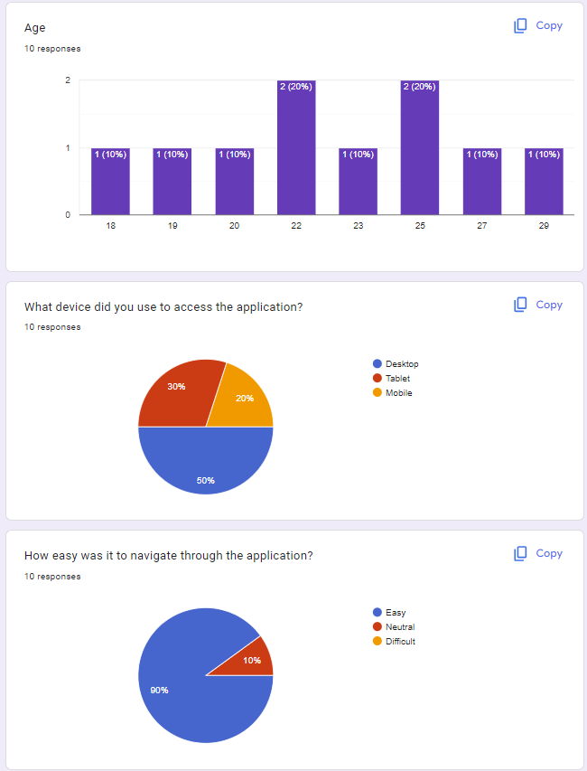

# Testing Policy Document 

## Table of Contents

- **[Introduction](#introduction)**
- **[Purpose](#purpose)**
- **[Objectives](#objectives)**
- **[Testing Process](#testing-process)**
    - **[Unit Testing](#unit-testing)**
    - **[Integration Testing](#integration-testing)**
    - **[Automation and CI Pipeline](#automation-and-ci-pipeline)**
- **[Quality Assurance Metrics and Testing](#quality-assurance-metrics-and-testing)**
- **[Usability](#usability)**

## Introduction

The Writeme app is a platform built to inspire creativity through collaborative writing, writathons, and story sharing. With an active and growing user base, ensuring a smooth, reliable, and secure user experience is paramount. The app’s success depends on the consistent performance of key features such as real-time collaboration, story filtering, and user interactions.

## Purpose 

To maintain these standards, this Testing Policy outlines the necessary processes for identifying and addressing potential issues at every stage of development. It defines the objectives, scope, and testing strategies required to ensure the app functions as intended, remains secure, and provides a high-quality experience for all users.

By establishing a clear testing framework, this document aims to guarantee that all features, from the user interface to the backend infrastructure, work seamlessly and efficiently, with minimal disruptions to the user experience. The ultimate goal is to ensure the Writeme app consistently meets and exceeds the expectations of its creative community.

## Objectives 

Our goal is to identify and address all potential use cases and edge cases that users may encounter. This preparation ensures the app can effectively handle various scenarios related to story submissions, writathons, and filtering options. For example, if a user experiences a network issue during story submission, the app will notify them and allow them to save their work locally, preventing data loss in case of unexpected refreshes.

By implementing these preventive and recovery strategies, the Writeme app will be well-equipped to manage errors gracefully, delivering a smooth and reliable user experience.

## Testing Process

Our team employs Vitest, Playwright, and Storybook as the primary testing tools to conduct unit and integration tests for the Writeme app. These tools streamline the testing process, ensuring comprehensive coverage of both individual components and their interactions across the app. To automate and enforce consistency, GitHub Actions serves as the continuous integration (CI) pipeline, ensuring that all tests are executed before code merges into the main branch.

Our goal is to achieve at least 75% test coverage by the end of the project to ensure the app meets quality standards.

### Unit Testing

For unit testing, we utilize Vitest. This tool thoroughly examines each function, component, and service within the app, verifying that they behave as expected in isolation. Vitest automates this process, providing immediate feedback when any part of the code is altered or when dependencies change. Additionally, Storybook is used to visually test individual UI components, allowing us to catch design or interaction issues before they affect the user experience.

By integrating both functional and visual unit tests, we ensure the correctness and stability of the app's core components, such as story creation, filtering options, and writathon interactions.

### Integration Testing

Integration testing is conducted using Playwright, which facilitates end-to-end testing by simulating real-world user interactions across multiple browsers. Playwright allows us to evaluate how different parts of the app—such as story submission, filtering systems, and writathon participation—work together. This ensures that the app behaves correctly when users perform complex actions that involve multiple components interacting in sequence.

Playwright can also be used for both live tests, which access real external resources, and mocked tests, where dependencies are simulated. Mocked tests are particularly useful when testing against external APIs or other services, allowing us to simulate various scenarios like network issues or service failures without the overhead of live resource usage.

### Automation and CI Pipeline

All tests, both unit and integration, are automatically run within the GitHub Actions pipeline. This ensures that any code changes are thoroughly tested before being merged into the release branch. The pipeline logs all test results, providing immediate feedback on failures or issues, helping us identify and resolve bugs quickly.

In cases where live integration tests require resources that aren't available in the GitHub Actions environment, we rely on mocked tests to ensure consistent testing. This approach helps us maintain high test coverage and code quality while keeping the CI process efficient and reliable.

## Quality Assurance Metrics and Testing

In our effort to ensure a robust application, we have identified five key quality attributes that our Writeme app must meet:

1. Usability
2. Compatibility
3. Security
4. Performance
5. Reliability

### Usability

Usability is vital for fostering user adoption and engagement. The application must present an intuitive interface, straightforward navigation, and a responsive design that allows users—regardless of their technical background—to access features seamlessly. By prioritizing usability, the app reduces user frustration and enhances overall productivity.

**How We Achieve This**

**Onboarding Experience:** New users undergo an onboarding process that introduces them to the app's features. This is implemented using shadcn and Framer Motion, allowing users to activate or deactivate the guide at their discretion.

**Feedback Mechanisms:** Users receive immediate feedback upon completing an action or encountering an error. This is facilitated through various toast notifications that provide contextual messages as shown below. In case of errors, detailed messages will inform users about potential issues. To ensure a smooth experience, these notifications are implemented asynchronously to avoid any freezing or lag in the interface. 

**Mesurement of Usability**

**Efficiency Metrics:** We evaluated the time and steps required to complete typical tasks, aiming for a significant reduction in both to enhance user efficiency.

**Error Reduction:** We tracked user errors and recovery times to measure the effectiveness of our design, striving for fewer mistakes and quicker resolutions.

**User Satisfaction:** High levels of user satisfaction were gauged through usability testing sessions and feedback forms, ensuring continuous improvement based on user insights.

You can see part of our **Usability Testing Report** below:

You can also see the **Feedback Forms** we used 

and the **Results**:

