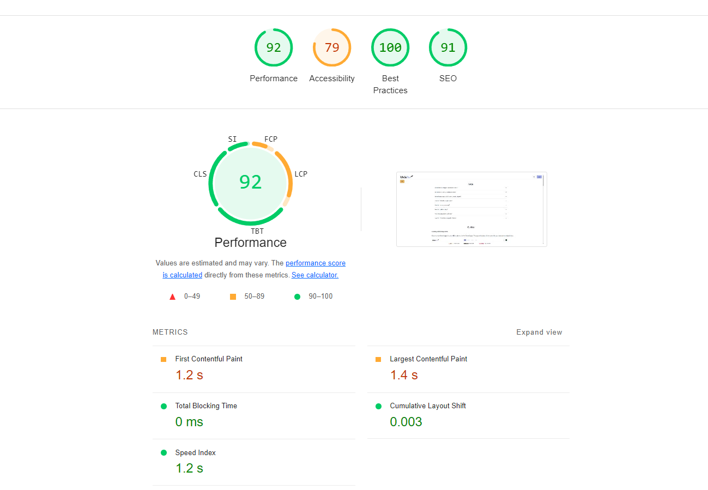

# Testing Policy Document 

## Table of Contents

- **[Introduction](#introduction)**
- **[Purpose](#purpose)**
- **[Objectives](#objectives)**
- **[Testing Process](#testing-process)**
    - **[Unit Testing](#unit-testing)**
    - **[Integration Testing](#integration-testing)**
    - **[Automation and CI Pipeline](#automation-and-ci-pipeline)**
- **[Quality Assurance Metrics and Testing](#quality-assurance-metrics-and-testing)**
- **[Usability](#usability)**
- **[Compatibility](#compatibility)**
- **[Security](#security)**
- **[Performance](#performance)**
- **[Reliability](#reliability)**

## Introduction

The Writeme app is a platform built to inspire creativity through collaborative writing, writathons, and story sharing. With an active and growing user base, ensuring a smooth, reliable, and secure user experience is paramount. The app’s success depends on the consistent performance of key features such as real-time collaboration, story filtering, and user interactions.

## Purpose 

To maintain these standards, this Testing Policy outlines the necessary processes for identifying and addressing potential issues at every stage of development. It defines the objectives, scope, and testing strategies required to ensure the app functions as intended, remains secure, and provides a high-quality experience for all users.

By establishing a clear testing framework, this document aims to guarantee that all features, from the user interface to the backend infrastructure, work seamlessly and efficiently, with minimal disruptions to the user experience. The ultimate goal is to ensure the Writeme app consistently meets and exceeds the expectations of its creative community.

## Objectives 

Our goal is to identify and address all potential use cases and edge cases that users may encounter. This preparation ensures the app can effectively handle various scenarios related to story submissions, writathons, and filtering options. For example, if a user experiences a network issue during story submission, the app will notify them and allow them to save their work locally, preventing data loss in case of unexpected refreshes.

By implementing these preventive and recovery strategies, the Writeme app will be well-equipped to manage errors gracefully, delivering a smooth and reliable user experience.

## Testing Process

Our team employs Vitest, Playwright, and Storybook as the primary testing tools to conduct unit and integration tests for the Writeme app. These tools streamline the testing process, ensuring comprehensive coverage of both individual components and their interactions across the app. To automate and enforce consistency, GitHub Actions serves as the continuous integration (CI) pipeline, ensuring that all tests are executed before code merges into the main branch.

Our goal is to achieve at least 75% test coverage by the end of the project to ensure the app meets quality standards.

### Unit Testing

For unit testing, we utilize Vitest. This tool thoroughly examines each function, component, and service within the app, verifying that they behave as expected in isolation. Vitest automates this process, providing immediate feedback when any part of the code is altered or when dependencies change. Additionally, Storybook is used to visually test individual UI components, allowing us to catch design or interaction issues before they affect the user experience.

By integrating both functional and visual unit tests, we ensure the correctness and stability of the app's core components, such as story creation, filtering options, and writathon interactions.

### Integration Testing

Integration testing is conducted using Playwright, which facilitates end-to-end testing by simulating real-world user interactions across multiple browsers. Playwright allows us to evaluate how different parts of the app—such as story submission, filtering systems, and writathon participation—work together. This ensures that the app behaves correctly when users perform complex actions that involve multiple components interacting in sequence.

Playwright can also be used for both live tests, which access real external resources, and mocked tests, where dependencies are simulated. Mocked tests are particularly useful when testing against external APIs or other services, allowing us to simulate various scenarios like network issues or service failures without the overhead of live resource usage.

### Automation and CI Pipeline

All tests, both unit and integration, are automatically run within the GitHub Actions pipeline. This ensures that any code changes are thoroughly tested before being merged into the release branch. The pipeline logs all test results, providing immediate feedback on failures or issues, helping us identify and resolve bugs quickly.

In cases where live integration tests require resources that aren't available in the GitHub Actions environment, we rely on mocked tests to ensure consistent testing. This approach helps us maintain high test coverage and code quality while keeping the CI process efficient and reliable.

## Quality Assurance Metrics and Testing

In our effort to ensure a robust application, we have identified five key quality attributes that our Writeme app must meet:

1. Usability
2. Compatibility
3. Security
4. Performance
5. Reliability

### Usability

Usability is vital for fostering user adoption and engagement. The application must present an intuitive interface, straightforward navigation, and a responsive design that allows users—regardless of their technical background—to access features seamlessly. By prioritizing usability, the app reduces user frustration and enhances overall productivity.

**How We Achieve This**

- Onboarding Experience: New users undergo an onboarding process that introduces them to the app's features. This is implemented using shadcn and Framer Motion, allowing users to activate or deactivate the guide at their discretion.

- Feedback Mechanisms: Users receive immediate feedback upon completing an action or encountering an error. This is facilitated through various toast notifications that provide contextual messages as shown below. In case of errors, detailed messages will inform users about potential issues. To ensure a smooth experience, these notifications are implemented asynchronously to avoid any freezing or lag in the interface. 

**Mesurement of Usability**

- Efficiency Metrics: We evaluated the time and steps required to complete typical tasks, aiming for a significant reduction in both to enhance user efficiency.

- Error Reduction: We tracked user errors and recovery times to measure the effectiveness of our design, striving for fewer mistakes and quicker resolutions.

- User Satisfaction: High levels of user satisfaction were gauged through usability testing sessions and feedback forms, ensuring continuous improvement based on user insights.

You can see part of our **Usability Testing Report** below:

You can also see the **Feedback Forms** we used 

and the **Results**:

### Compatibility

Compatibility across different platforms and devices was essential for expanding the application's reach and usability. By supporting a wide range of operating systems, browsers, and device types, we ensured that users could access and interact with the application seamlessly, regardless of their preferred technology. This broad compatibility enhanced user convenience and accessibility, contributing to a positive user experience.

**How We Achieve This**

- Cross-Platform Availability: The application was developed as a Progressive Web App (PWA), allowing it to function across any operating system or device with a modern web browser. This ensured consistent performance on Windows, macOS, Linux, Android, and iOS devices.

- Mobile and Browser Compatibility: We implemented well-supported CSS and JavaScript features to ensure compatibility with all major web browsers, including Chrome, Firefox, Safari, and Edge. Additionally, the app was tested to ensure responsiveness and usability across different screen sizes, from mobile phones to large desktop displays.

**Measurement of Compatibility**

We employed **Google Lighthouse** to test the application's performance as a Progressive **Web App (PWA)**. This tool provided insights into the app's load speed, mobile usability, and browser compatibility across different platforms.

- Visual Testing: Extensive visual testing sessions were conducted across different platforms to ensure that the layout and design remained consistent and functional. Feedback was collected from users operating on a variety of devices and operating systems.

- Error Reduction: By focusing on compatibility, we reduced platform-specific errors and ensured the app worked consistently across devices. When errors did occur, they were swiftly identified and resolved.

### Security

Security is essential to protect user data, maintain trust, and ensure compliance with regulatory standards. Our application implements strong measures to prevent unauthorized access, data breaches, and other malicious activities. We have deployed a combination of authentication, encryption, and access control mechanisms to secure user information.

**How We Achieve This**

- User Authentication via Hashed Passwords:
To ensure secure user authentication, we used bcrypt to hash user passwords with the Blowfish algorithm. Only the hashed passwords are stored in the database, preventing unauthorized access even in the event of a data breach.

Justification:
Hashing passwords using bcrypt ensures that user credentials are protected. Even if the database is compromised, the original passwords remain unrecoverable due to the hashing process. This adds a strong layer of security against brute-force attacks.

**Measurement:**
Password security was verified by conducting penetration tests to assess the strength of the hashing mechanism. 

- JWT-Based Authentication for Access Control:
We implemented JWT (JSON Web Token) authentication to manage user sessions. When a user logs in, a JWT is generated and signed with a private key, valid for 24 hours. Each request made to the API must include this JWT as a bearer token, ensuring only authenticated users can access sensitive functionalities.

Justification:
JWTs provide a stateless authentication method, ensuring that user sessions are secure without overloading the server. By signing JWTs with a private key, we ensure that the tokens cannot be tampered with or forged, protecting against session hijacking.

**Measurement:**
We tested the JWT system for vulnerabilities such as token expiration, replay attacks, and token tampering. Additionally, we monitored login logs to ensure no unauthorized users accessed protected pages.

- Data Encryption for Sensitive Information:
All sensitive user data transmitted between the client and the server is encrypted using TLS (Transport Layer Security), ensuring that data such as passwords, access tokens, and personal information are protected from interception by malicious entities.

Justification:
TLS encryption ensures secure communication between the user and the server, preventing man-in-the-middle attacks and eavesdropping. This is crucial for protecting sensitive information, especially during login or while transmitting private data.

**Measurement:**
We used network traffic monitoring tools to verify that all sensitive data was transmitted securely and no plaintext information could be intercepted. Security scanning tools were used to check for weaknesses in encryption protocols.

- Access Control for Published Works:
Authors can control who has access to their published works through a robust access control mechanism. They can restrict access to certain users, allow public access, or disable it entirely. Additionally, authors can toggle the ability to export their works as PDFs.

Justification:
This feature gives authors the flexibility to protect their content based on their preferences, ensuring that sensitive or unpublished works are not exposed to unauthorized users.

**Measurement:**
We conducted role-based access control tests to verify that only authorized users could access or export content. Security reviews were carried out to confirm that no bypasses or unauthorized access were possible.

### Performance

Performance is crucial to ensuring a smooth and responsive user experience. Our application is optimized to handle high traffic, perform tasks efficiently, and scale as usage increases. By focusing on performance, we minimize load times, reduce server strain, and ensure that users can complete tasks without unnecessary delays or interruptions.

**How We Achieve This**

- Asynchronous API Requests: We used asynchronous requests to ensure that API calls do not block the UI. By employing Next.js for server-side rendering and streaming responses back to the client, the webpage remains responsive while waiting for data.

- Fast File Uploads: File uploads are managed using AWS S3 buckets, where files are streamed directly from the API to the bucket, bypassing the server to reduce processing time.

- High Volume Database Transactions: The system is designed to handle high traffic with hundreds of users daily, making frequent read and write operations. We used optimized database queries, proper indexing, and connection pooling to ensure minimal response times for database interactions.

**Measurement of Performance**
We employed **Google Lighthouse** to measure the performance of our app.

### Reliability

Reliability is essential for ensuring consistent availability and functionality of the application. Achieving high uptime and minimizing downtime through reliable hosting, proactive monitoring, and efficient error handling processes guarantees uninterrupted service for users. By prioritizing reliability, the application builds user confidence, supports continuous operations, and minimizes disruptions that could impact user productivity or experience.

**How We Achieve This**

-High Uptime Guarantee: The system is hosted on AWS, which provides a robust infrastructure with a service level agreement (SLA) that assures an uptime greater than 99%. By leveraging AWS's global network of data centers, we ensure that the application remains accessible to users at all times.

- Continuous Integration and Deployment (CI/CD): We utilize GitHub Actions in conjunction with SST (Serverless Stack) for deploying new features and fixes, ensuring that the application can be updated without incurring downtime. This orchestration allows for seamless rollouts and quick recovery from any issues.

- Proactive Error Handling: The application employs comprehensive error logging through AWS CloudWatch, which captures runtime errors and sends alerts to developers when error thresholds are exceeded. This enables timely identification and resolution of issues before they affect users.

- Load Balancing and Redundancy: To ensure that the application can handle high traffic volumes and remain functional during server failures, we have implemented load balancing across multiple instances. This redundancy ensures that if one instance goes down, others can take over without impacting user access.

**Measurement of Reliability**

- Deployment frequency, lead time for changes, and the mean time to recover (MTTR) from failures are tracked to measure the effectiveness of our CI/CD processes.

-  We analyze error rates, incident response times, and resolution times to gauge the effectiveness of our error handling processes. Regular reviews of error logs help us identify recurring issues and implement preventive measures.

- We monitor the performance of load balancers and track metrics such as response time and traffic distribution to ensure optimal operation.